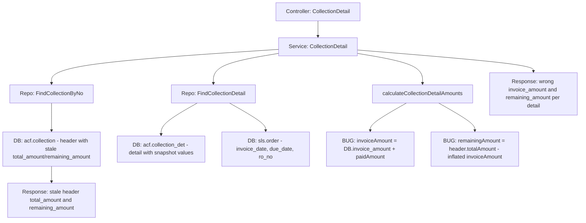

# SX-1340: AR Collection Calculation Defect Analysis & Fix Plan

## Ringkasan Masalah

Endpoint `GET /v1/account-receivables/collection/:collection_no` mengembalikan kalkulasi yang salah pada beberapa field. Root cause terletak di fungsi [`calculateCollectionDetailAmounts()`](finance/service/ar_service.go:779) dan bagaimana header `total_amount` / `remaining_amount` diambil langsung dari database tanpa rekomputasi.

---

## Analisis Data Aktual vs Expected

### Data dari API Response

| Invoice | invoice_amount | paid_amount | remaining_amount | invoice_payment | paid_amount_by_collection |
|---------|---------------|-------------|-----------------|-----------------|--------------------------|
| INV2603150002 | 2,827,500 | 500,000 | 2,048,000 | 2,127,500 | 500,000 |
| INV2603150001 | 2,548,000 | 0 | 2,327,500 | 0 | 0 |

Header: `total_amount = 4,875,500`, `remaining_amount = 3,248,000`

### Verifikasi Matematis

- `total_amount = 2,827,500 + 2,048,000 = 4,875,500` → Ini BUKAN sum of invoice_amount, tapi sum of invoice_amount row-level yang sudah di-inflate
- Header `remaining_amount = 3,248,000` tapi sum detail `remaining_amount = 2,048,000 + 2,327,500 = 4,375,500` → **TIDAK COCOK**
- Untuk INV2603150002: `invoice_payment(2,127,500) - paid_amount_by_collection(500,000) = 1,627,500` tapi `remaining_amount = 2,048,000` → **SALAH**

---

## Analisis Root Cause Per File

### Bug #1: [`calculateCollectionDetailAmounts()`](finance/service/ar_service.go:779)

```go
func calculateCollectionDetailAmounts(totalAmount *float64, detail model.CollectionDetList) (...) {
    paidAmountByCollection = safeFloat64(detail.PaidAmount)           // dari DB: paid_amount
    invoicePayment = safeFloat64(detail.TotalInvoicePayment)         // dari DB: paid_by_invoice AS total_invoice_amount
    invoiceAmount = safeFloat64(detail.InvoiceAmount) + paidAmountByCollection  // BUG: kenapa ditambah?
    paidAmount = paidAmountByCollection
    remainingAmount = safeFloat64(totalAmount) - invoiceAmount       // BUG: pakai header totalAmount
    return
}
```

**Masalah spesifik:**

1. **`invoiceAmount` di-inflate**: `invoiceAmount = DB.invoice_amount + paidAmountByCollection`. Ini mengambil `invoice_amount` dari tabel `acf.collection_det` lalu menambah `paid_amount`. Harusnya `invoice_amount` adalah nominal asli invoice - tidak perlu ditambah apa-apa.

2. **`remainingAmount` dihitung dari header `totalAmount`**: Formula `remainingAmount = totalAmount - invoiceAmount` menghitung remaining per-row sebagai selisih antara HEADER total dan invoice amount row itu sendiri. Ini secara semantik salah - remaining seharusnya dihitung per-invoice.

3. **Formula yang benar seharusnya**:
   - `invoice_amount` = nilai asli invoice dari `sls.order.total` (bukan dari `acf.collection_det.invoice_amount`)
   - `invoice_payment` = total yang sudah terbayar untuk invoice ini (dari deposit yang approved)
   - `paid_amount_by_collection` = amount yang di-assign ke collection ini untuk invoice ini (`acf.collection_det.paid_amount`)
   - `remaining_amount` = `invoice_amount - invoice_payment` (outstanding invoice setelah semua payment)

### Bug #2: Header `total_amount` dan `remaining_amount`

Di [`CollectionDetail()`](finance/service/ar_service.go:390), header values di-copy langsung dari database via `structs.Automapper(collectionDetail, &response)`. Field [`CollectionList.TotalAmount`](finance/model/ar.go:166) dan [`CollectionList.RemainingAmount`](finance/model/ar.go:167) berasal dari kolom `acf.collection.total_amount` dan `acf.collection.remaining_amount` yang merupakan **stored values saat collection dibuat**.

Masalahnya: nilai ini **stale** - tidak dihitung ulang berdasarkan state terkini dari payment/deposit.

### Bug #3: Repository Query [`FindCollectionDetail()`](finance/repository/ar_repository.go:351)

```sql
acf.collection_det.*,
acf.collection_det.paid_by_invoice AS total_invoice_amount
```

- Mengambil `invoice_amount`, `remaining_amount`, `paid_amount` dari `acf.collection_det` - ini adalah **snapshot values** saat collection dibuat
- `paid_by_invoice` di-alias ke `total_invoice_amount` - field ini juga snapshot
- **Tidak ada query ke `acf.deposit_detail`** untuk mendapatkan actual paid amounts yang sudah approved

### Bug #4: Model [`CollectionDetList.TotalInvoicePayment`](finance/model/ar_det.go:62) salah mapping

```go
TotalInvoicePayment *float64 `gorm:"column:total_invoice_amount" json:"total_invoice_amount"`
```

Field Go bernama `TotalInvoicePayment` tapi column-nya `total_invoice_amount` (dari alias `paid_by_invoice AS total_invoice_amount`). Ini membuat confusion antara apa itu "invoice payment" vs "invoice amount".

---

## Data Flow Diagram



---

## Formula yang Benar

### Per Detail Row

| Field | Formula Benar | Sumber Data |
|-------|--------------|-------------|
| `invoice_amount` | Nilai total invoice asli | `sls.order.total` WHERE `invoice_no = ?` |
| `invoice_payment` | Total pembayaran yang sudah di-approve untuk invoice ini | `SUM(acf.deposit_detail.total_payment)` WHERE deposit_status IN 1,2 |
| `paid_amount_by_collection` | Jumlah yang di-assign di collection ini | `acf.collection_det.paid_amount` |
| `remaining_amount` | Sisa outstanding invoice | `invoice_amount - invoice_payment` |
| `total_invoice_amount` | Sama dengan `invoice_payment` | Alias/duplicate |

### Header

| Field | Formula Benar |
|-------|--------------|
| `total_amount` | `SUM(invoice_amount)` dari semua detail rows |
| `remaining_amount` | `SUM(remaining_amount)` dari semua detail rows |

---

## Pseudo-code Fix

### Option A: Compute di Service Layer (Recommended)

```go
func (service *arServiceImpl) CollectionDetail(...) {
    // ... existing code ...

    var totalInvoiceAmount float64
    var totalRemainingAmount float64

    for _, detail := range Details {
        // Get actual invoice amount from sls.order
        // detail.InvoiceAmount is already from acf.collection_det
        // We need the REAL invoice total from sls.order
        
        // Get actual paid amount from deposit_detail
        invoicePaidAmount, _ := service.Repository.CountInvoicePaidAmount(detail.InvoiceNo, custID)
        
        // Calculate
        invoiceAmount := getInvoiceAmountFromOrder(detail)  // from join
        invoicePayment := invoicePaidAmount.PaidAmount
        paidAmountByCollection := safeFloat64(detail.PaidAmount)
        remainingAmount := invoiceAmount - invoicePayment

        detailData.InvoiceAmount = &invoiceAmount
        detailData.InvoicePayment = &invoicePayment
        detailData.PaidAmountByCollection = &paidAmountByCollection
        detailData.RemainingAmount = &remainingAmount
        detailData.TotalInvoicePayment = &invoicePayment

        totalInvoiceAmount += invoiceAmount
        totalRemainingAmount += remainingAmount
    }

    // Recompute header from details
    response.TotalAmount = &totalInvoiceAmount
    response.RemainingAmount = &totalRemainingAmount
}
```

### Option B: Compute di Repository Layer via SQL

Modifikasi query `FindCollectionDetail` untuk join dengan subquery yang menghitung `total_payment` dari `acf.deposit_detail` dan `sls.order.total` sebagai actual invoice amount.

---

## Expected Response yang Benar

Berdasarkan data sample, jika:
- INV2603150002 total invoice = X, total payment approved = Y
- INV2603150001 total invoice = A, total payment approved = B

Maka:
```json
{
    "total_amount": "SUM of actual invoice amounts",
    "remaining_amount": "SUM of per-invoice remaining",
    "details": [
        {
            "invoice_amount": "actual invoice total from sls.order",
            "invoice_payment": "SUM approved deposit payments",
            "paid_amount_by_collection": "acf.collection_det.paid_amount",
            "remaining_amount": "invoice_amount - invoice_payment"
        }
    ]
}
```

---

## Checklist Pengecekan Kode Backend

1. **Repository Query** [`FindCollectionDetail()`](finance/repository/ar_repository.go:351):
   - [ ] Tambah join ke `sls.order` untuk ambil `sls.order.total` sebagai actual invoice amount
   - [ ] Tambah subquery/join ke `acf.deposit_detail` + `acf.deposit` untuk hitung total approved payment per invoice
   - [ ] Atau: gunakan `CountInvoicePaidAmount()` yang sudah ada di service layer

2. **Service Calculation** [`calculateCollectionDetailAmounts()`](finance/service/ar_service.go:779):
   - [ ] Hapus formula `invoiceAmount = DB.invoice_amount + paidAmountByCollection`
   - [ ] Ganti dengan actual invoice amount dari join
   - [ ] Perbaiki `remainingAmount` formula: bukan dari header `totalAmount`, tapi `invoiceAmount - invoicePayment`

3. **Service Header** [`CollectionDetail()`](finance/service/ar_service.go:390):
   - [ ] Jangan langsung pakai `collectionDetail.TotalAmount` dan `collectionDetail.RemainingAmount` dari DB
   - [ ] Recompute header dari sum of computed detail values

4. **Model** [`CollectionDetList`](finance/model/ar_det.go:45):
   - [ ] Review apakah perlu tambah field untuk actual invoice total dari `sls.order`

5. **Unit Tests** [`ar_service_test.go`](finance/service/ar_service_test.go:8):
   - [ ] Update existing test cases dengan formula baru
   - [ ] Tambah test case untuk edge cases: zero payment, full payment, partial payment

6. **Entity** [`CollectionDetResponse`](finance/entity/ar_det.go:57):
   - [ ] Review field naming: `total_invoice_amount` vs `invoice_payment` - pastikan konsisten

---

## Risiko Regresi

1. **Create/Update Collection**: Endpoint POST/PUT/PATCH collection menyimpan `total_amount` dan `remaining_amount` ke tabel `acf.collection`. Jika kita ubah cara hitung di GET, frontend mungkin mengirim value berbeda saat create/update.

2. **Collection List**: [`CollectionList()`](finance/service/ar_service.go:462) juga menampilkan `remaining_amount` dari DB. Perlu dipertimbangkan apakah list juga perlu recompute.

3. **Deposit Flow**: Modul deposit membaca collection data. Perubahan field naming/semantics bisa impact deposit creation.

4. **AR Settlement**: [`ArSettlementService`](finance/service/ar_settlement_service.go:12) juga terkait AR/collection. Perlu cross-check.

5. **Print Collection**: [`PrintCollection()`](finance/service/ar_service.go:633) mungkin menggunakan data yang sama.

---

## Langkah Implementasi

1. Fix [`calculateCollectionDetailAmounts()`](finance/service/ar_service.go:779) - ubah formula
2. Modifikasi [`FindCollectionDetail()`](finance/repository/ar_repository.go:351) - tambah join untuk actual invoice amount
3. Update [`CollectionDetail()`](finance/service/ar_service.go:390) - recompute header totals
4. Update model [`CollectionDetList`](finance/model/ar_det.go:45) jika perlu field baru
5. Update unit tests [`ar_service_test.go`](finance/service/ar_service_test.go:8)
6. Test endpoint dan verifikasi response
7. Cross-check dengan endpoint terkait (collection list, deposit, AR settlement)
