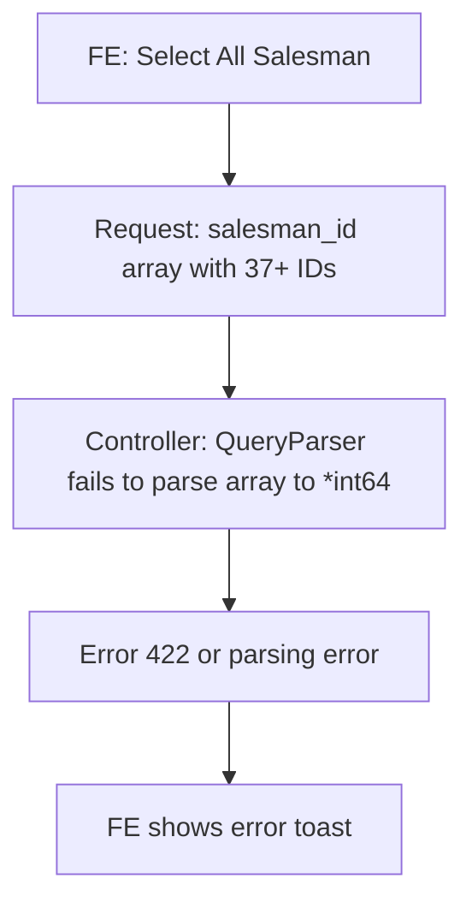
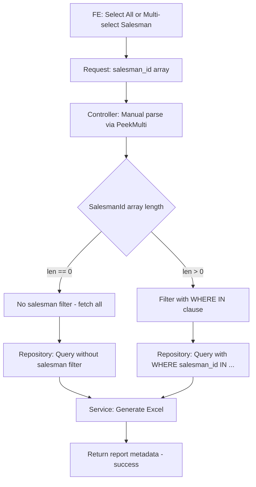

# Plan: Fix Download Sales Order - Select All Salesman (SX-1402)

## Ticket
[SX-1402](https://scyllax-pratesis.atlassian.net/browse/SX-1402) - Download Sales Order error saat Select All Salesman

## Root Cause Analysis

### Problem
Endpoint `GET /sales/v1/download` gagal saat FE mengirim banyak `salesman_id[]` (Select All).

### Root Cause
Di [`SoDownloadQueryFilter`](sales/entity/so_download.go:8), field `SalesmanId` didefinisikan sebagai `*int64` (single value pointer):

```go
SalesmanId   *int64 `query:"salesman_id"`
```

Padahal FE mengirim `salesman_id[]=62,204,206,...,382` sebagai array. Fiber `QueryParser` tidak bisa mem-parse array query parameter ke single `*int64`, sehingga parsing error terjadi.

### Impact Chain



### Evidence
1. **Entity** [`SoDownloadQueryFilter.SalesmanId`](sales/entity/so_download.go:8) = `*int64` - hanya support single value
2. **Repository** semua 4 query method menggunakan `WHERE sls.order.salesman_id = ?` bukan `IN ?`:
   - [`FindDownloadDataPo`](sales/repository/so_repository.go:243)
   - [`FindDownloadDataSo`](sales/repository/so_repository.go:301)
   - [`FindDownloadDataFinal`](sales/repository/so_repository.go:359)
   - [`FindDownloadQtySummary`](sales/repository/so_repository.go:414)
3. **Existing pattern** yang benar sudah ada di [`OrderController.ProformaInvoiceList()`](sales/controller/order_controller.go:341-373) yang menggunakan `PeekMulti` untuk handle array query params

## Files to Modify

| File | Layer | Change |
|------|-------|--------|
| [`sales/entity/so_download.go`](sales/entity/so_download.go:8) | Entity | `SalesmanId *int64` → `SalesmanId []int64` |
| [`sales/controller/so_controller.go`](sales/controller/so_controller.go:250) | Controller | Add manual array parsing for `salesman_id[]` |
| [`sales/repository/so_repository.go`](sales/repository/so_repository.go:243) | Repository | Change 4x `WHERE = ?` → `WHERE IN ?` |
| [`sales/service/so_service.go`](sales/service/so_service.go:506) | Service | Update salesman info header for multi-salesman |

## Detailed Changes

### 1. Entity: `sales/entity/so_download.go`

**Before:**
```go
type SoDownloadQueryFilter struct {
    CustId       string
    ParentCustId string
    StartDate    int64  `query:"start_date" validate:"required,gte=1000000000"`
    EndDate      int64  `query:"end_date" validate:"required,gte=1000000000"`
    SalesmanId   *int64 `query:"salesman_id"`
    ExportBy     string
    ReportID     string
}
```

**After:**
```go
type SoDownloadQueryFilter struct {
    CustId       string
    ParentCustId string
    StartDate    int64   `query:"start_date" validate:"required,gte=1000000000"`
    EndDate      int64   `query:"end_date" validate:"required,gte=1000000000"`
    SalesmanId   []int64 // Parsed manually in controller, supports multiple salesman IDs
    ExportBy     string
    ReportID     string
}
```

### 2. Controller: `sales/controller/so_controller.go`

Add manual parsing for `salesman_id[]` array in `Download()` method, reusing the existing pattern from [`ProformaInvoiceList()`](sales/controller/order_controller.go:341-373):

- Use `c.Context().QueryArgs().PeekMulti("salesman_id")` and `PeekMulti("salesman_id[]")`
- Support comma-separated fallback: `salesman_id=62,204,206`
- Support bracket array format: `salesman_id[]=62&salesman_id[]=204`
- When `SalesmanId` is empty after parsing, treat as no filter - fetch all salesman data

### 3. Repository: `sales/repository/so_repository.go`

Change all 4 download query methods:

**Before (repeated in 4 methods):**
```go
if filter.SalesmanId != nil {
    query = query.Where("sls.order.salesman_id = ?", *filter.SalesmanId)
}
```

**After (repeated in 4 methods):**
```go
if len(filter.SalesmanId) > 0 {
    query = query.Where("sls.order.salesman_id IN ?", filter.SalesmanId)
}
```

### 4. Service: `sales/service/so_service.go`

Update salesman info in Excel header. Currently it takes info from first data row only, which works for single salesman. For multiple salesman, show "All Salesmen" or "Multiple Salesmen" or leave salesman info empty:

**Before:**
```go
salesmanInfo := ""
if len(dataPo) > 0 {
    // takes single salesman info from first row
}
```

**After:**
```go
salesmanInfo := ""
if len(filter.SalesmanId) == 0 {
    salesmanInfo = "All Salesmen"
} else if len(filter.SalesmanId) == 1 && len(dataPo) > 0 {
    // Keep existing single salesman logic
} else if len(filter.SalesmanId) > 1 {
    salesmanInfo = "Multiple Salesmen"
}
```

## Data Flow After Fix



## Test Plan

1. **Single salesman:** `GET /v1/download?start_date=X&end_date=Y&salesman_id[]=62` - should work as before
2. **Multiple salesman:** `GET /v1/download?start_date=X&end_date=Y&salesman_id[]=62&salesman_id[]=204&salesman_id[]=206` - should work
3. **Select All (37+ salesman):** Full CURL from ticket should succeed
4. **No salesman filter:** `GET /v1/download?start_date=X&end_date=Y` - should return all salesman data
5. **Comma-separated:** `GET /v1/download?start_date=X&end_date=Y&salesman_id[]=62,204,206` - should work as comma-split

## Backward Compatibility

- Perubahan ini **backward compatible** karena:
  - Format `salesman_id=62` single value masih di-support via PeekMulti
  - Format `salesman_id[]=62` single bracket juga di-support
  - Empty salesman_id = fetch all - ini behavior baru tapi acceptable
