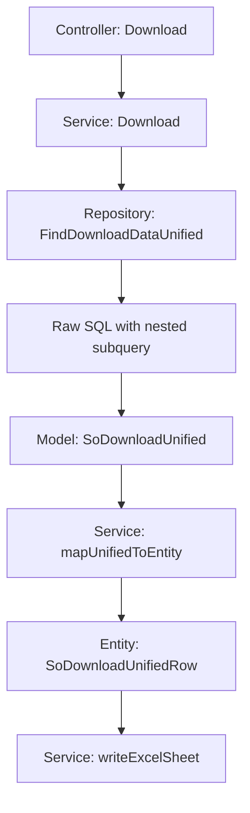

# SX-1402 Phase 2: Refactor Download Sales Order Query

## Context

Setelah fix awal SX-1402 (parsing `salesman_id[]` dan `IN clause`), user meminta refactoring total query download agar sesuai dengan SQL referensi yang benar. Query saat ini punya beberapa masalah fundamental dibandingkan query yang diharapkan.

## Gap Analysis: Query Saat Ini vs Query yang Diminta

### Perbedaan Kunci

| Aspek | Query Saat Ini | Query Yang Diminta |
|-------|---------------|-------------------|
| **Jumlah Query** | 4 query terpisah: PO, SO, Final, QtySummary | 1 unified query dengan nested subquery |
| **Unit Info** | Ambil `unit_id1/2/3` dari `order_detail` | `CONCAT(mp.unit_id3, '/', mp.conv_unit2)` dll dari `m_product` |
| **System Price** | `order_detail.sell_price_system1/2/3` | `mp.sell_price1/2/3` dari `m_product` |
| **Final Selling Price** | Ambil langsung per sheet: PO=`sell_price_po`, SO=`sell_price`, Final=`sell_price_final` | `COALESCE(sell_price_final, sell_price_po, sell_price, 0)` cascade |
| **Qty** | Ambil langsung per sheet: PO=`qty_po`, SO=`qty`, Final=`qty_final` | `COALESCE(qty_final, qty_po, qty, 0)` cascade |
| **Promotion** | `disc_value_final` saja | CASE WHEN cascade: `promo_final1-5` → `promo_so1-5` → `promo_po1-5` |
| **Discount** | `vat_value_final` saja | `COALESCE(disc_value_final, disc_value, disc_value_po, 0)` |
| **VAT** | `vat_value_final` | `COALESCE(vat_value_final, vat_value, vat_value_po, 0)` |
| **Gross Price** | Dihitung di Go mapper | Dihitung di SQL: `final_price3 * qty3 + final_price2 * qty2 + final_price1 * qty1` |
| **Net Sales** | Dihitung di Go mapper | Dihitung di SQL: `gross_price - promotion - discount` |
| **Kolom Tambahan** | Tidak ada `order_no`, `invoice_date`, `invoice_no` | Ada `o.order_no`, `o.invoice_date`, `o.invoice_no` |
| **Employee Join** | `m_employee.emp_id` + `m_salesman.sales_name` | `m_employee.emp_code` + `m_employee.emp_name` |

### Perbedaan Join

| Aspek | Saat Ini | Yang Diminta |
|-------|----------|-------------|
| **Order → Outlet** | LEFT JOIN dengan `cust_id` filter | JOIN tanpa explicit `cust_id` |
| **Employee** | LEFT JOIN `m_salesman` + LEFT JOIN `m_employee` | LEFT JOIN subquery `m_employee` |
| **Product** | LEFT JOIN `m_product` dengan `parent_cust_id` | JOIN `m_product` langsung |
| **Supplier** | LEFT JOIN `m_supplier` dengan `parent_cust_id` | JOIN `m_supplier` langsung |

## Approach

Karena query yang diminta cukup kompleks dengan nested subquery dan CASE WHEN, pendekatan terbaik adalah menggunakan **raw SQL** di GORM daripada chained query builder.

### Flow Arsitektur

## File Yang Perlu Diubah

### 1. `sales/model/so_download.go`
- Tambah struct `SoDownloadUnified` dengan semua kolom dari query baru
- Kolom: `order_no`, `ro_no`, `ro_date`, `invoice_date`, `invoice_no`, `outlet_code`, `outlet_name`, `emp_code`, `emp_name`, `sup_code`, `sup_name`, `pro_code`, `pro_name`, `largest_unit`, `middle_unit`, `small_unit`, `largest_system_price`, `middle_system_price`, `small_system_price`, `final_largest_selling_price`, `final_middle_selling_price`, `final_small_selling_price`, `largest_qty_order`, `middle_qty_order`, `smallest_qty_order`, `promotion_value`, `discount_value`, `vat_value`, `gross_price`, `net_sales`

### 2. `sales/entity/so_download.go`
- Tambah struct `SoDownloadUnifiedRow` yang mirror kolom output
- Semua field computed sudah di-handle di SQL level

### 3. `sales/repository/so_repository.go`
- Tambah method `FindDownloadDataUnified(filter) ([]model.SoDownloadUnified, error)`
- Gunakan `repository.Raw(sql, params...).Scan(&results)` untuk raw SQL
- SQL menggunakan 3-level nested subquery: base → calc gross → calc net

### 4. `sales/service/so_service.go`
- Update `generateDownloadSalesOrderExcel` untuk menggunakan `FindDownloadDataUnified`
- Buat mapper baru `mapUnifiedToEntity`
- Update Excel writer untuk kolom baru

### 5. Test Files
- Update unit tests di `so_service_test.go`
- Pastikan mapper baru menghasilkan output yang sesuai CSV referensi

## Validasi Data

CSV referensi disimpan di `docs/_SELECT_calc_calc_gross_price_COALESCE_calc_promotion_value_0_CO_202603141400.csv` dan berisi 400 baris data yang harus di-match persis oleh output Excel baru.

## Catatan Penting

- Query baru **menggabungkan** data PO/SO/Final menjadi 1 dataset unified menggunakan COALESCE cascade
- Tidak ada lagi 4 sheet terpisah - cukup 1 sheet dengan data yang sudah unified
- `item_type = 1` filter tetap dipertahankan di backend meskipun tidak ada di SQL referensi user, perlu dikonfirmasi
- Multi-tenant filtering (`cust_id`) tetap harus dipertahankan di backend meskipun SQL referensi user tidak menyertakannya
