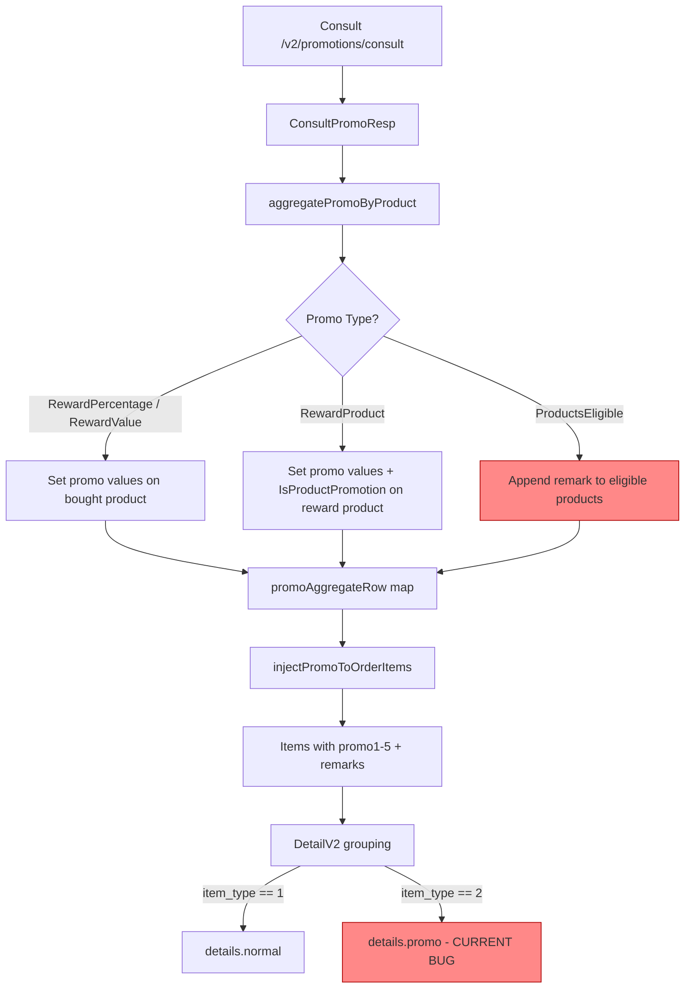
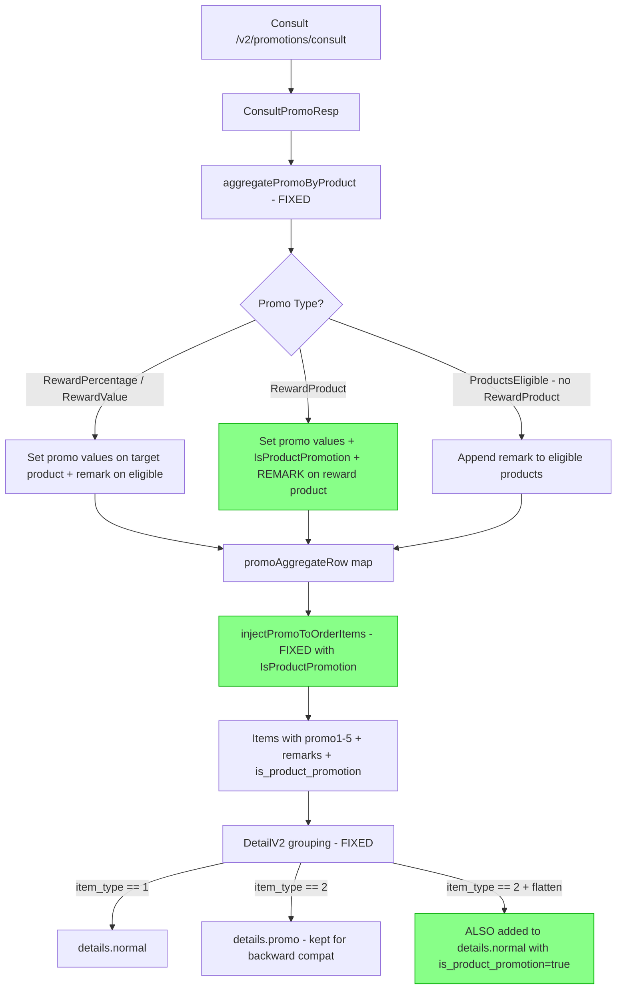

# SX-1430: Fix Promo Detail pada Sales Order Response

## Jira: SX-1430
## Status: Diagnosis Confirmed, Ready for Implementation

---

## 1. Root Cause Summary

Dua akar masalah utama ditemukan di `sales/service/order_service.go`:

### Bug A: Reward product tidak muncul di `details.normal[]`
- **Lokasi**: `DetailV2()` line 2268
- **Masalah**: Grouping logic mengarahkan `item_type == 2` ke `details.promo[]`, bukan `details.normal[]`
- **Dampak**: UI hanya menampilkan 2 produk (bought items), bukan 3 (termasuk reward)

### Bug B: Remark promo attached ke bought product, bukan reward product
- **Lokasi**: `aggregatePromoByProduct()` line 843
- **Masalah**: Remark di-append ke `ProductsEligible` (bought items), sementara `RewardProduct` loop hanya set promo values tanpa remark
- **Dampak**: Remark "value get qty" muncul di produk yang dibeli, bukan di produk reward

### Bug C (Minor): `injectPromoToOrderItems()` tidak propagate `IsProductPromotion`
- **Lokasi**: `injectPromoToOrderItems()` line 1091
- **Masalah**: Flag `IsProductPromotion` dari `promoData` tidak di-assign ke item
- **Dampak**: Saat runtime promo injection (tanpa persisted snapshot), flag tidak ter-set

---

## 2. Failed Test Cases

### SO2603140006
- **Issue**: Discount remarks tidak muncul
- **Scenario**: 1 product + promo bukan qty + diskon, kombinasi 2 promo bukan qty + diskon
- **Expected**: Remarks diskon tampil di detail order / item yang relevan

### SO2603140007
- **Issue**: Produk promo (reward) tidak muncul; remarks muncul di produk yang dibeli
- **Consult data**: `products_eligible: [722, 731]`, `reward_product.pro_id: 723`
- **Expected**:
  - pro_id 723 harus ada di `details.normal[]` dengan remark "value get qty" dan `is_product_promotion = true`
  - pro_id 732 harus punya: gross = 24.000.000, promo1 = 4.000.000, promo2 = 8.000.000, promo3 = 12.000.000

---

## 3. Data Flow: Current vs Expected



### Expected Flow After Fix



---

## 4. Changes Required

### 4.1 Fix `aggregatePromoByProduct()` (line 829)

**File**: `sales/service/order_service.go`

**Current code** (line 872-882):
```go
for _, reward := range promo.RewardProduct {
    row := result[reward.ProID]
    row.Promo1 += reward.Promo1
    // ... promo values ...
    row.IsProductPromotion = true
    result[reward.ProID] = row
}
```

**Required change**: Add remark to reward product row (not eligible product):
```go
for _, reward := range promo.RewardProduct {
    row := result[reward.ProID]
    row.Promo1 += reward.Promo1
    // ... promo values ...
    row.IsProductPromotion = true
    row = appendRemark(row, promo.PromoID)  // ADD THIS
    result[reward.ProID] = row
}
```

**Remark policy change for `ProductsEligible` loop**:
- When a promo has `RewardProduct` entries, do NOT append remarks to eligible products (bought products) — the remark belongs on the reward product
- When a promo has only `RewardPercentage` or `RewardValue` (diskon langsung), keep remarks on eligible products since the benefit applies directly to those items

```go
for _, eligibleProID := range promo.ProductsEligible {
    row := result[eligibleProID]
    // Only attach remark to eligible product if this is NOT a product-reward promo
    if len(promo.RewardProduct) == 0 {
        row = appendRemark(row, promo.PromoID)
    }
    result[eligibleProID] = row
}
```

### 4.2 Fix `DetailV2()` — Flatten reward items (line 2268 + line 2481)

**File**: `sales/service/order_service.go`

After the promo grouping loops finish and `details.promo[]` is populated, add a flatten step that copies reward items into `details.normal[]`:

```go
// After line 2321 (for sales tab):
for _, promoItem := range response.Details.Promo {
    promoItem.IsProductPromotion = true
    response.Details.Normal = append(response.Details.Normal, promoItem)
}

// After line 2539 (for final tab):
for _, promoItem := range response.DetailsFinal.Promo {
    promoItem.IsProductPromotion = true
    response.DetailsFinal.Normal = append(response.DetailsFinal.Normal, promoItem)
}

// For purchase details — since it's copied from Details, 
// re-copy after flatten to include reward items
```

**Important**: `details.promo[]` is KEPT for backward compatibility. The flatten only COPIES items to `details.normal[]`.

### 4.3 Fix `injectPromoToOrderItems()` (line 1091)

**File**: `sales/service/order_service.go`

Add `IsProductPromotion` propagation:
```go
if promoData, ok := promoMap[items[i].ProId]; ok {
    items[i].Promo1 = promoData.Promo1
    // ... existing code ...
    items[i].IsProductPromotion = promoData.IsProductPromotion  // ADD THIS
}
```

### 4.4 Update existing tests

**File**: `sales/service/order_service_test.go`

Tests that currently assert reward products go to `Promo[]` or `RewardProducts[]` only need to also verify they appear in `Normal[]` after the flatten.

### 4.5 New unit tests

| Test | What it validates |
|------|-------------------|
| `TestAggregatePromoByProduct_RemarkOnRewardProduct` | Remark attaches to reward product pro_id, not eligible pro_id |
| `TestAggregatePromoByProduct_RemarkOnEligibleForNonProductReward` | Remark stays on eligible product when promo is percentage/value type |
| `TestDetailV2_RewardProductInNormal` | Reward product appears in `Details.Normal[]` with `is_product_promotion=true` |
| `TestDetailV2_DiscountRemarksAppear` | Discount remarks render correctly for non-qty promo scenario |
| `TestInjectPromoToOrderItems_PropagatesIsProductPromotion` | `IsProductPromotion` flag propagated from promoMap |

---

## 5. Impact Analysis

### Files Changed
| File | Change Type |
|------|-------------|
| `sales/service/order_service.go` | Bug fix (3 functions) |
| `sales/service/order_service_test.go` | New tests + update existing |

### No Changes Required
| File | Reason |
|------|--------|
| `sales/entity/order_detail.go` | Struct already has `IsProductPromotion` field |
| `sales/entity/promotionV2.go` | ConsultPromoResp already correct |
| `sales/model/order_detail.go` | DB model unchanged (item_type=2 persistence stays) |
| `sales/repository/` | No repository changes needed |
| `sales/controller/` | No controller changes needed |

### Backward Compatibility
- `details.promo[]` tetap ada → FE yang masih menggunakannya tidak terdampak
- `item_type = 2` di database tidak berubah → persistence layer aman
- `RewardProducts[]` summary tetap diisi → informasi reward product summary masih tersedia

---

## 6. Verification Plan

1. Build dan run `go test ./sales/service/... -run TestAggregate -v`
2. Build dan run `go test ./sales/service/... -run TestDetailV2 -v`
3. Build dan run `go test ./sales/service/... -run TestInjectPromo -v`
4. Start sales service, hit API detail untuk SO2603140006 dan SO2603140007
5. Verify response JSON:
   - SO2603140007: `details.normal[]` punya 3 items (termasuk pro_id 723 dengan `is_product_promotion: true`)
   - SO2603140007: Remark "value get qty" hanya ada di pro_id 723, bukan 722/731
   - SO2603140006: Discount remarks muncul di item yang relevan
