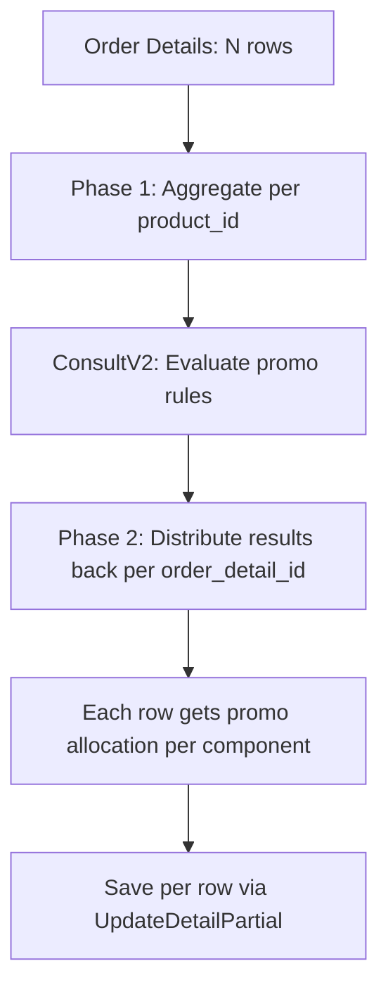
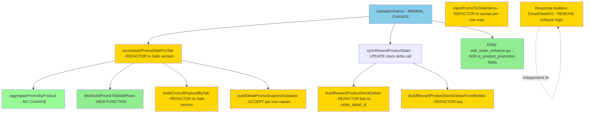
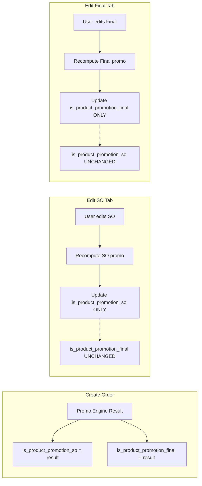
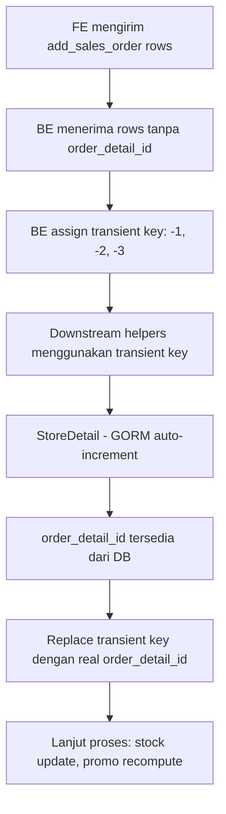

# Architecture Design: SX-1451 - Fix Duplicate Product ID dalam Satu SO

**Issue**: SX-1451 — "(BE) Case 2 id product yang sama di dalam satu SO"  
**Endpoint**: `PATCH /sales/v1/orders/enhance/{so_number}`  
**Entry Point**: [`UpdateEnhance()`](sales/service/order_service.go:4600)

---

## A. Fix Design Utama

### A.1 Root Cause Analysis

Flow utama [`UpdateEnhance()`](sales/service/order_service.go:4600) sudah **aman** karena melakukan matching berdasarkan `order_detail_id + cust_id` via [`FindOrderDetailByDetailID()`](sales/repository/order_repository.go:673) dan [`UpdateDetailPartial()`](sales/repository/order_repository.go:688).

Bug terjadi di **downstream helper functions** yang menggunakan `map[int]` keyed by `product_id`. Ketika satu SO memiliki 2+ row dengan `product_id` yang sama tetapi `order_detail_id` berbeda, map overwrite menyebabkan data loss.

### A.2 Bug Map — Fungsi yang Terdampak

| # | Fungsi | Lokasi | Key Saat Ini | Impact |
|---|--------|--------|--------------|--------|
| 1 | [`ConsultV2()`](sales/service/promotion_service.go:2350) | promotion_service.go:2350 | `map[string]map[int]*ConPromoV2Det` by `ProID` | Row kedua overwrite row pertama |
| 2 | [`aggregatePromoByProduct()`](sales/service/order_service.go:829) | order_service.go:829 | `map[int]promoAggregateRow` by `ProID` | Promo values digabung jadi satu |
| 3 | [`buildRewardProductStockDeltas()`](sales/service/order_service.go:1025) | order_service.go:1025 | `map[int]*SalesOrderStockUpdate` by `ProId` | Stock delta kehilangan identity row asal |
| 4 | [`buildRewardProductStockDeltasFromModels()`](sales/service/order_service.go:1464) | order_service.go:1464 | `map[int]*rewardStockAggregate` by `ProId` | Stock aggregate merge per product |
| 5 | [`buildProductMetaMap()`](sales/service/order_service.go:1136) | order_service.go:1136 | `map[int]OrderDetResponse` by `ProId` | Metadata hanya menyimpan row pertama |
| 6 | [`buildDetailPromoSnapshotUpdates()`](sales/service/order_service.go:973) | order_service.go:973 | `aggregate[detail.ProId]` | Semua row same-product dapat promo sama |
| 7 | [`recomputePromoStateForTab()`](sales/service/order_service.go:1705) | order_service.go:1705 | `aggregate[detail.ProId]` | Promo lookup collision |
| 8 | [`injectPromoToOrderItems()`](sales/service/order_service.go:1095) | order_service.go:1095 | `promoMap[items[i].ProId]` | Same promo to all same-product rows |
| 9 | Response builder [`Detail()`](sales/service/order_service.go:1959) | order_service.go:1959 | `map[int]OrderDetResponse` | Promo rows collapse by product |
| 10 | Response builder [`DetailV2()`](sales/service/order_service.go:2255) | order_service.go:2255 | `map[int]OrderDetResponse` | Promo rows collapse by product |

### A.3 Prinsip Desain

> **"Identity per row, aggregate only when needed, always retain source"**

| Prinsip | Penjelasan |
|---------|-----------|
| **Identity per row** | Setiap `order_detail_id` adalah identitas unik. Map keys HARUS menggunakan `order_detail_id` |
| **Aggregate only when needed** | Agregasi per `product_id` hanya boleh dilakukan saat promo engine memang membutuhkan total qty per product untuk rule evaluation |
| **Always retain source** | Setelah agregasi, hasil HARUS di-distribute kembali ke masing-masing row berdasarkan `order_detail_id` |

### A.4 Kapan Menggunakan Key Apa

| Situasi | Key yang Benar | Alasan |
|---------|---------------|--------|
| Promo rule evaluation input | `product_id` — aggregate qty | Promo engine butuh total qty per product untuk threshold check |
| Promo result distribution | `order_detail_id` — per row | Setiap row harus punya snapshot promo independen |
| Stock delta calculation | `order_detail_id` — per row | Setiap detail row punya stock movement sendiri |
| Metadata lookup | `product_id` — per product | Metadata produk seperti code, name, unit, conv, dan master attributes tetap valid di level produk |
| Response builder | Per row tanpa collapse | Client harus melihat semua row |
| DB update via `UpdateDetailPartial` | `order_detail_id` — already safe | Sudah benar di codebase |

### A.5 Arsitektur Fix: Two-Phase Promo Pattern



**Strategi distribusi promo:**

Distribusi **tidak boleh diasumsikan selalu proporsional**. Promo harus dialokasikan kembali ke row berdasarkan **komponen promo** yang dihasilkan engine:
- `reward_percentage` → umumnya proporsional by gross
- `reward_value per_order` → sesuai rule `per_scope`
- `reward_value per_product` → umumnya proporsional by qty
- `reward_product` → tidak didistribusikan ke row normal, tetapi dibuat sebagai row promo terpisah

Rule distribusi final ada di [`Section J`](plans/SX-1451-duplicate-product-id-fix.md).

---

## B. Refactor Per Fungsi

### B.1 `ConsultV2()` — [`promotion_service.go:2350`](sales/service/promotion_service.go:2350)

**Current behavior:**
```go
validatedPromoProductGroups := make(map[string]map[int]*entity.ConPromoV2Det)
// ...
validatedPromoProductGroups[promoID][detail.ProID] = &req.Details[index]
```
Key `detail.ProID` (product_id) → row kedua dengan product_id yang sama overwrite row pertama.

**Proposed behavior:**
Karena `ConsultV2()` secara desain memang mengevaluasi promo per product (threshold check berdasarkan total qty), maka input ke `ConsultV2()` perlu **pre-aggregated per product_id**. Yang berubah adalah:
1. **Sebelum** memanggil `ConsultV2()`, aggregate semua row dengan `product_id` sama menjadi satu `ConPromoV2Det` entry (sum qty, sum gross)
2. `ConsultV2()` tetap bekerja dengan product-level granularity
3. **Setelah** mendapat result dari `ConsultV2()`, distribute hasilnya kembali ke per-row

**Perubahan di `ConsultV2()` sendiri:** TIDAK PERLU DIUBAH — karena input sudah di-aggregate sebelum masuk.

**Perubahan di caller:** Fungsi [`buildConsultPayloadByTab()`](sales/service/order_service.go:736) yang membangun payload untuk `ConsultV2()` harus memastikan items sudah di-aggregate per product_id. Saat ini fungsi ini memang menambahkan semua items tanpa deduplicate. Ini AMAN selama `ConsultV2()` menerima list (bukan map), tapi `ConsultV2()` internal membuat map by `ProID` → inilah yang harus di-fix.

**Opsi yang direkomendasikan:**
- **Opsi A**: Pre-aggregate di `buildConsultPayloadByTab()` — sum qty per product_id sebelum kirim ke `ConsultV2()`. Lebih aman, tidak mengubah `ConsultV2()`.
- **Opsi B**: Ubah `ConsultV2()` internal map dari `map[int]*ConPromoV2Det` ke `[]ConPromoV2Det` — lebih invasif, banyak regression risk.

**Rekomendasi: Opsi A** — Pre-aggregate di caller.

**Butuh new struct:** Tidak. Cukup pre-aggregate `[]entity.ConPromoV2Det` sebelum kirim.

### B.2 `aggregatePromoByProduct()` — [`order_service.go:829`](sales/service/order_service.go:829)

**Current behavior:**
```go
func aggregatePromoByProduct(consultResp []entity.ConsultPromoResp) map[int]promoAggregateRow
```
Return `map[int]promoAggregateRow` keyed by `product_id`. Ini tetap valid sebagai **intermediate aggregate** hasil promo engine di level product.

**Proposed behavior:**
Fungsi ini **tetap** menghasilkan aggregate per product — karena memang itulah granularity output dari consult promo. Yang berubah adalah cara caller menggunakannya sesudah itu.

Caller tidak boleh lagi langsung memakai aggregate ini seolah-olah final per row. Setelah aggregate per product terbentuk, hasilnya harus diproses oleh fungsi distribusi yang **component-aware**.

Buat fungsi baru `distributePromoToDetailRowsV2()` yang:
1. menerima `map[int]promoAggregateRow` sebagai aggregate per `product_id`
2. menerima `[]model.OrderDetailRead` sebagai source rows
3. menerima `[]entity.ConsultPromoResp` agar bisa membaca komponen promo
4. mengembalikan `map[int]promoAggregateRow` keyed by `order_detail_id`
5. melakukan distribusi **per komponen promo**, bukan satu rule proporsional universal

**Butuh new function:**
```go
func distributePromoToDetailRowsV2(
    aggregate map[int]promoAggregateRow,
    details []model.OrderDetailRead,
    tab promoSnapshotTab,
    consultResp []entity.ConsultPromoResp,
) map[int]promoAggregateRow // keyed by order_detail_id
```

Catatan:
- `reward_percentage` umumnya didistribusikan by gross
- `reward_value per_order` mengikuti rule `per_scope`
- `reward_value per_product` umumnya didistribusikan by qty
- `reward_product` tidak didistribusikan ke row normal

Rincian final distribusi dirujuk ke [`Section J.3`](plans/SX-1451-duplicate-product-id-fix.md).

### B.3 `buildRewardProductStockDeltas()` — [`order_service.go:1025`](sales/service/order_service.go:1025)

**Current behavior:**
```go
existingMap := make(map[int]*entity.SalesOrderStockUpdate)
existingMap[detail.ProId] = &entity.SalesOrderStockUpdate{...}
```
Key by `product_id` → row kedua overwrite. Juga di [`buildRewardProductStockDeltasFromModels()`](sales/service/order_service.go:1464):
```go
aggregates := make(map[int]*rewardStockAggregate)
aggregates[detail.ProId] = aggregate
```

**Proposed behavior:**
Untuk **reward product** (item_type=2), stock delta memang bisa legitimate di-aggregate per product karena:
- Reward products di-delete dan re-create setiap kali promo recalculate
- `syncRewardProductState()` melakukan `DeletePromoDetails()` lalu re-insert

**Namun**, jika ada 2 reward rows dengan product_id sama dari 2 promo berbeda, merge-nya harus benar.

**Key change:** Ubah key dari `product_id` ke `order_detail_id`:

```go
existingMap := make(map[int64]*entity.SalesOrderStockUpdate) // key: order_detail_id
for _, detail := range existingRewards {
    if detail.OrderDetailID != nil {
        existingMap[int64(*detail.OrderDetailID)] = &entity.SalesOrderStockUpdate{...}
    }
}
```

**Catatan:** Untuk `buildRewardProductStockDeltasFromModels()`, karena ini menangani reward products yang di-delete dan re-create, perlu strategi matching yang berbeda. Gunakan pendekatan: semua existing reward = qtyBefore, semua new reward = qtyAfter, hitung delta per row.

**Butuh new struct:** Tidak. Cukup ubah map key type.

### B.4 `buildProductMetaMap()` — [`order_service.go:1136`](sales/service/order_service.go:1136)

**Current behavior:**
```go
func buildProductMetaMap(items []entity.OrderDetResponse) map[int]entity.OrderDetResponse {
    result := make(map[int]entity.OrderDetResponse)
    for _, item := range items {
        if _, exists := result[item.ProId]; !exists {
            result[item.ProId] = item  // Only first occurrence
        }
    }
    return result
}
```
Hanya menyimpan row pertama per product_id. Used by [`buildRewardProducts()`](sales/service/order_service.go:1190) untuk mendapatkan product metadata (name, code, units).

**Proposed behavior:**
Fungsi ini dipakai untuk mendapatkan product metadata (nama, kode, unit). Karena metadata per product memang sama untuk semua row, fungsi ini **TETAP keyed by product_id** — karena purpose-nya adalah product lookup, bukan row lookup.

**Tidak perlu diubah** — penggunaan sudah benar untuk konteks metadata lookup.

### B.5 Response Builder — [`order_service.go:1959`](sales/service/order_service.go:1959) & [`order_service.go:2255`](sales/service/order_service.go:2255)

**Current behavior:**
Di [`Detail()`](sales/service/order_service.go:1959):
```go
promoDetails := map[int]entity.OrderDetResponse{}
// ...
if promoDetail, exists := promoDetails[detailData.ProId]; exists {
    // Aggregate quantities
    promoDetails[detailData.ProId] = promoDetail
} else {
    promoDetails[detailData.ProId] = detailData
}
```
Promo rows dengan same product_id di-collapse menjadi satu entry dengan qty dijumlahkan.

Pola yang sama terjadi di [`DetailV2()`](sales/service/order_service.go:2255) line 2336-2380 dan untuk `promoFinalDetails` (line 2478-2598).

**Proposed behavior:**
Ubah response builder agar TIDAK melakukan collapse. Setiap promo detail row harus ditampilkan sebagai entry terpisah di response:

```go
// BEFORE (collapse)
promoDetails := map[int]entity.OrderDetResponse{}
// ...
promoDetails[detailData.ProId] = detailData

// AFTER (no collapse)
if detailData.ItemType == 2 {
    response.Details.Promo = append(response.Details.Promo, detailData)
}
```

**Impact:** Response JSON akan menampilkan multiple promo rows dengan product_id sama — ini correct behavior karena setiap row berasal dari promo berbeda.

**Butuh new struct:** Tidak. Hanya ubah logic dari map-based collapse ke direct append.

---

## C. Backward Compatibility

### C.1 Field Baru: `is_product_promotion_so *bool` dan `is_product_promotion_final *bool`

**Status saat ini:**

| Layer | Field Ada? | File |
|-------|-----------|------|
| Model `OrderDetail` | ✅ Ada | [`sales/model/order_detail.go:80-81`](sales/model/order_detail.go:80) |
| Model `OrderDetailRead` | ✅ Ada | [`sales/model/order_detail.go:243-245`](sales/model/order_detail.go:243) |
| Response `OrderDetResponse` | ✅ Ada (non-pointer) | [`sales/entity/order_detail.go:93`](sales/entity/order_detail.go:93) |
| Create `CreateOrderDetBody` | ✅ Ada | [`sales/entity/order_detail.go:3`](sales/entity/order_detail.go:3) |
| **Edit `EditSalesOrderDetail`** | ❌ **Missing** | [`sales/entity/edit_order_enhance.go:37`](sales/entity/edit_order_enhance.go:37) |
| **Edit `EditFinalOrderDetail`** | ❌ **Missing** | [`sales/entity/edit_order_enhance.go:49`](sales/entity/edit_order_enhance.go:49) |
| **Add `AddSalesOrderDetail`** | ❌ **Missing** | [`sales/entity/edit_order_enhance.go:78`](sales/entity/edit_order_enhance.go:78) |
| **Add `AddFinalOrderDetail`** | ❌ **Missing** | [`sales/entity/edit_order_enhance.go:122`](sales/entity/edit_order_enhance.go:122) |

### C.2 Dimana Menambahkan

Tambahkan field berikut di [`sales/entity/edit_order_enhance.go`](sales/entity/edit_order_enhance.go):

```go
// EditSalesOrderDetail — tambah:
IsProductPromotionSo *bool `json:"is_product_promotion_so,omitempty"`

// EditFinalOrderDetail — tambah:
IsProductPromotionFinal *bool `json:"is_product_promotion_final,omitempty"`

// AddSalesOrderDetail — tambah:
IsProductPromotionSo *bool `json:"is_product_promotion_so,omitempty"`

// AddFinalOrderDetail — tambah:
IsProductPromotionFinal *bool `json:"is_product_promotion_final,omitempty"`
```

### C.3 Update Flow — Propagasi ke DB

Di [`UpdateEnhance()`](sales/service/order_service.go:4600), saat membangun `updates` map untuk `UpdateDetailPartial()`:

```go
// Sales Order tab (Case 2)
if detail.IsProductPromotionSo != nil {
    updates["is_product_promotion_so"] = *detail.IsProductPromotionSo
}

// Final Order tab (Case 3)
if detail.IsProductPromotionFinal != nil {
    updates["is_product_promotion_final"] = *detail.IsProductPromotionFinal
}
```

### C.4 Insert Flow — Set untuk Row Baru

Di [`createOrderDetailFromSalesOrder()`](sales/service/order_service.go:5191):
```go
orderDetail.IsProductPromotionSo = addDetail.IsProductPromotionSo

defaultFalse := false
orderDetail.IsProductPromotionFinal = &defaultFalse
```

Di [`createOrderDetailFromFinalOrder()`](sales/service/order_service.go:5282):
```go
orderDetail.IsProductPromotionFinal = addDetail.IsProductPromotionFinal
```

Catatan: kedua flag bersifat independen. Tidak boleh ada cascade dari `is_product_promotion_so` ke `is_product_promotion_final`.

### C.5 Fallback — Client Lama yang Tidak Mengirim Field

Karena field menggunakan **pointer** (`*bool`) dengan `omitempty`:
- Jika client lama tidak mengirim field → value = `nil`
- `nil` tidak akan di-include dalam `updates` map → field di DB tidak berubah
- Promo recompute via [`recomputePromoStateForTab()`](sales/service/order_service.go:1652) akan otomatis set flag yang benar berdasarkan promo engine result
- **Tidak ada breaking change** untuk client lama

### C.6 Dampak ke Response

- Response entity [`OrderDetResponse`](sales/entity/order_detail.go:93) sudah memiliki `IsProductPromotionSo bool` dan `IsProductPromotionFinal bool`
- Field ini di-set oleh [`applyPersistedPromoSnapshotToItems()`](sales/service/order_service.go:892) dan [`injectPromoToOrderItems()`](sales/service/order_service.go:1095)
- **Tidak ada dampak** ke response yang sudah ada — field sudah exist

---

## D. Risk & Edge Cases

### D.1 Regression Risks

| # | Risk | Severity | Mitigasi |
|---|------|----------|----------|
| 1 | **Promo engine mengandalkan agregasi per product** — `ConsultV2()` internally uses `map[int]` | HIGH | Pre-aggregate input di caller, bukan ubah `ConsultV2()` |
| 2 | **Response collapse sengaja untuk UI** — frontend mungkin expect 1 row per product di promo section | HIGH | Koordinasi dengan frontend team, verify UI handling |
| 3 | **Stock double-count** — jika `buildRewardProductStockDeltas()` salah handle multiple rows | HIGH | Unit test dengan 2 reward rows same product, verify delta correctness |
| 4 | **Concurrent edit pada same-product rows** — 2 user edit row berbeda dari product sama secara bersamaan | MEDIUM | Transaction isolation sudah handle via `WithinTransaction()`, tapi promo recompute bisa race. Mitigation: row-level locking atau version check |
| 5 | **Mobile app vs web behavior** — Mobile mungkin mengirim data berbeda | MEDIUM | Test kedua platform, verify `data_source` handling di `UpdateEnhance()` |
| 6 | **Promo proporsional rounding** — distribusi promo per row bisa ada selisih pembulatan | LOW | Gunakan "last row gets remainder" pattern |
| 7 | **`Store()` / `Update()` flow** — fungsi selain `UpdateEnhance()` juga menggunakan `aggregatePromoByProduct()` | MEDIUM | Audit semua caller: `prepareCreateOrderPromoState()`, `DetailV2()`, `recomputePromoStateForTab()` |

### D.2 Edge Cases

| # | Edge Case | Expected Behavior |
|---|-----------|------------------|
| 1 | **Semua row same-product dihapus (qty=0)** | Stock delta harus mencatat total qty before, qty after = 0. Promo recompute harus exclude rows dengan qty=0 |
| 2 | **Add new row dengan product_id yang sudah ada** | Row baru di-insert sebagai entry terpisah. Promo recompute harus include semua rows (existing + new) dalam aggregate per product |
| 3 | **Promo reward product menghasilkan row baru same-product** | `syncRewardProductState()` melakukan `DeletePromoDetails()` + re-insert. Jika reward menghasilkan 2 rows product sama dari 2 promo berbeda, masing-masing harus tersimpan sebagai row terpisah — ini sudah AMAN karena `buildCreateOrderRewardDetails()` iterate per promo+reward tanpa map |
| 4 | **Edit hanya salah satu row dari same-product** | Hanya row yang di-edit berubah. Promo recompute menggunakan total qty semua rows per product untuk threshold check, lalu distribute proporsional kembali |
| 5 | **Row normal + row promo dari product yang sama** | `item_type` membedakan keduanya. Normal rows (type=1) dan promo rows (type=2) sudah dihandle terpisah di response builder |
| 6 | **3+ rows dengan product_id yang sama** | Semua fungsi harus handle N rows, bukan hanya 2. Distribution formula harus menggunakan ratio bukan absolute value |
| 7 | **Product dengan qty=0 di salah satu row** | Row tetap exist di DB. Promo calculation berdasarkan total qty — row qty=0 kontribusi 0 ke gross, promo distribution = 0 |
| 8 | **SO dibuat dari mobile lalu di-edit dari web** | `data_source` field menentukan field mapping. Harus pastikan both paths handle duplicate product correctly |

---

## E. Test Plan

### E.1 Unit Tests

```
[ ] Test: 2 row same product_id, beda order_detail_id
    - Input: details [{id:1, pro_id:100, qty1:5}, {id:2, pro_id:100, qty1:3}]
    - Assert: setiap row diproses independen, tidak ada data loss

[ ] Test: Regular row + promo row dari product sama
    - Input: [{id:1, pro_id:100, item_type:1}, {id:2, pro_id:100, item_type:2}]
    - Assert: kedua row muncul di response terpisah

[ ] Test: Edit salah satu row saja dari duplicate product
    - Input: edit detail id:1 qty1=10, detail id:2 untouched
    - Assert: hanya id:1 berubah, id:2 tetap

[ ] Test: Delete salah satu row (qty=0)
    - Input: set qty1=0 pada detail id:1, detail id:2 tetap qty1=5
    - Assert: stock delta correct, promo recalculated for remaining qty

[ ] Test: Add row baru dengan product_id yang sudah ada
    - Input: existing [{id:1, pro_id:100}] + add_sales_order [{pro_id:100}]
    - Assert: 2 rows exist after operation

[ ] Test: Final order dan sales order konsisten
    - Input: duplicate product in both SO and Final tab
    - Assert: consistent behavior across tabs

[ ] Test: distributePromoToDetailRows proporsional
    - Input: 2 rows, gross 1000 dan 500, total promo 150
    - Assert: row1 promo=100, row2 promo=50

[ ] Test: distributePromoToDetailRows with rounding
    - Input: 3 rows, total promo 100
    - Assert: sum of distributed promo == 100 exactly

[ ] Test: Promo consult dengan duplicate product
    - Input: 2 items same product_id to ConsultV2
    - Assert: promo evaluated on aggregated qty, result distributed back

[ ] Test: Stock delta dengan duplicate product
    - Input: 2 reward rows same product, different qty
    - Assert: 2 separate stock delta entries

[ ] Test: Response builder tanpa collapse
    - Input: 3 promo detail rows, 2 same product_id
    - Assert: response.Details.Promo has 3 entries

[ ] Test: buildProductMetaMap tetap per product
    - Input: 2 rows same product
    - Assert: returns 1 metadata entry (correct for lookup purpose)
```

### E.2 Integration Tests

```
[ ] Test: End-to-end PATCH enhance dengan duplicate product
    - Setup: Create SO with 2 rows product_id=100 via Store()
    - Action: PATCH enhance, edit both rows with different qty
    - Assert: response 200, no errors

[ ] Test: Verify DB state setelah enhance
    - After PATCH enhance
    - Assert: sls.order_detail has 2 separate rows for product_id=100
    - Assert: each row has correct qty, promo_so, promo_final values
    - Assert: is_product_promotion_so set correctly

[ ] Test: Verify stock state setelah enhance
    - After PATCH enhance
    - Assert: inv.warehouse_stock has correct delta per row
    - Assert: stock movement records reference correct order_detail_id

[ ] Test: Verify response structure
    - After PATCH enhance, call GET DetailV2
    - Assert: response.details.normal contains all rows
    - Assert: response.details.promo contains all promo rows without collapse
    - Assert: reward_products listed correctly
```

---

## F. Pseudocode

### F.1 `distributePromoToDetailRows()` — Obsolete Draft

Pseudocode distribusi versi awal yang memakai asumsi **selalu proporsional by gross** harus dianggap **obsolete** dan **tidak dipakai untuk implementasi**.

Implementasi harus mengikuti pendekatan final di [`Section J.3`](plans/SX-1451-duplicate-product-id-fix.md), yaitu:
- evaluasi per `product_id` hanya untuk kebutuhan promo engine
- distribusi kembali dilakukan per `order_detail_id`
- alokasi promo dilakukan **per komponen promo**, bukan satu rule proporsional universal
- `reward_product` tetap menjadi row promo terpisah

### F.2 `buildStockDeltasByDetailRows()` — Stock delta per detail row

```go
// buildRewardProductStockDeltasSafe handles duplicate product_id reward rows
// by keying on order_detail_id instead of product_id
func buildRewardProductStockDeltasSafe(
    custID, roNo string, whID int64, roDate time.Time,
    existingRewards []model.OrderDetailRead,
    newRewards []entity.OrderRewardProductResponse,
) []*entity.SalesOrderStockUpdate {
    updates := make([]*entity.SalesOrderStockUpdate, 0)

    // Step 1: Build stock reversal for ALL existing reward rows
    for _, detail := range existingRewards {
        if detail.ItemType != 2 || detail.OrderDetailID == nil {
            continue
        }
        refDetID := int64(*detail.OrderDetailID)
        unitPrice := getValueOrDefault(detail.SellPriceFinal1, 0)
        qtyBefore := getValueOrDefault(detail.QtyFinal, 0)

        if qtyBefore == 0 {
            continue // No stock to reverse
        }

        trCode := ""
        if len(roNo) >= 2 {
            trCode = roNo[0:2]
        }
        updates = append(updates, &entity.SalesOrderStockUpdate{
            CustID:         custID,
            WhID:           whID,
            ProID:          int64(detail.ProId),
            StockDate:      roDate,
            TrCode:         trCode,
            TrNo:           roNo,
            QtyOrderBefore: float64Ptr(qtyBefore),
            QtyOrder:       0, // reverse
            UnitPrice:      unitPrice,
            RefDetId:       refDetID,
        })
    }

    // Step 2: Build stock entries for new reward rows
    // newRewards are from ConsultV2 result — each entry is separate
    for _, reward := range newRewards {
        qtyOrder := reward.Qty1 + reward.Qty2 + reward.Qty3
        if qtyOrder == 0 {
            continue
        }
        trCode := ""
        if len(roNo) >= 2 {
            trCode = roNo[0:2]
        }
        updates = append(updates, &entity.SalesOrderStockUpdate{
            CustID:         custID,
            WhID:           whID,
            ProID:          int64(reward.ProID),
            StockDate:      roDate,
            TrCode:         trCode,
            TrNo:           roNo,
            QtyOrderBefore: nil, // new row
            QtyOrder:       qtyOrder,
            UnitPrice:      reward.SellPrice1,
            // RefDetId will be set after StoreDetail
        })
    }

    sort.Slice(updates, func(i, j int) bool {
        return updates[i].ProID < updates[j].ProID
    })

    return updates
}
```

### F.3 `buildResponseWithoutCollapse()` — Response tanpa collapse

```go
// In Detail() and DetailV2(), replace the map-based promo collapse with direct append
// BEFORE:
//   promoDetails := map[int]entity.OrderDetResponse{}
//   if promoDetail, exists := promoDetails[detailData.ProId]; exists {
//       // ... merge quantities ...
//       promoDetails[detailData.ProId] = promoDetail
//   } else {
//       promoDetails[detailData.ProId] = detailData
//   }
//   for _, detail := range promoDetails {
//       response.Details.Promo = append(response.Details.Promo, detail)
//   }

// AFTER:
for _, detail := range details {
    var detailData entity.OrderDetResponse
    err = structs.Automapper(detail, &detailData)
    if err != nil {
        return response, err
    }
    // ... date formatting, qty conversion etc ...

    if detailData.ItemType == 1 {
        response.Details.Normal = append(response.Details.Normal, detailData)
    } else {
        // Direct append without collapse
        response.Details.Promo = append(response.Details.Promo, detailData)
    }
}
```

### F.4 `ConsultV2Safe()` — Pre-aggregate caller pattern

```go
// buildConsultPayloadByTabSafe pre-aggregates items with same product_id
// before sending to ConsultV2
func buildConsultPayloadByTabSafe(
    ro model.OrderList,
    items []entity.OrderDetResponse,
    custID string,
    parentCustID string,
) entity.ConsultPromoV2Req {
    // Pre-aggregate items by product_id
    type aggregatedItem struct {
        ProID      int
        TotalQty1  float64
        TotalQty2  float64
        TotalQty3  float64
        TotalGross float64
    }
    aggMap := make(map[int]*aggregatedItem)
    orderedProIds := make([]int, 0)

    for _, item := range items {
        if _, exists := aggMap[item.ProId]; !exists {
            aggMap[item.ProId] = &aggregatedItem{ProID: item.ProId}
            orderedProIds = append(orderedProIds, item.ProId)
        }
        agg := aggMap[item.ProId]
        qty1 := getValueOrDefault(item.Qty1, 0)
        qty2 := getValueOrDefault(item.Qty2, 0)
        qty3 := getValueOrDefault(item.Qty3, 0)
        price1 := getValueOrDefault(item.SellPrice1, 0)
        price2 := getValueOrDefault(item.SellPrice2, 0)
        price3 := getValueOrDefault(item.SellPrice3, 0)
        agg.TotalQty1 += qty1
        agg.TotalQty2 += qty2
        agg.TotalQty3 += qty3
        agg.TotalGross += (qty1 * price1) + (qty2 * price2) + (qty3 * price3)
    }

    // Build payload with aggregated items
    orderDate := ""
    if ro.RoDate != nil {
        orderDate = ro.RoDate.Format("2006-01-02")
    }

    payload := entity.ConsultPromoV2Req{
        CustID:       custID,
        ParentCustID: parentCustID,
        OrderDate:    orderDate,
        Details:      make([]entity.ConPromoV2Det, 0, len(aggMap)),
    }
    // ... set OutletID, SalesmanID, WhID from ro ...

    for _, proId := range orderedProIds {
        agg := aggMap[proId]
        payload.Details = append(payload.Details, entity.ConPromoV2Det{
            ProID:      agg.ProID,
            Qty1:       agg.TotalQty1,
            Qty2:       agg.TotalQty2,
            Qty3:       agg.TotalQty3,
            Total:      agg.TotalGross,
            GrossValue: int(math.Round(agg.TotalGross)),
        })
    }

    return payload
}
```

### F.5 `recomputePromoStateForTab()` — Refactored dengan component-aware distribution

```go
// recomputePromoStateForTabSafe is the refactored version that handles
// duplicate product_id by distributing promo per component back to detail rows.
func (service *orderServiceImpl) recomputePromoStateForTabSafe(
    ctx context.Context,
    ro model.OrderList,
    custID string, parentCustID string,
    details []model.OrderDetailRead,
    tab promoSnapshotTab,
) (model.Order, error) {
    headerUpdate := model.Order{}
    items := buildOrderItemsForPromoTab(details, tab)

    aggregateByProduct := map[int]promoAggregateRow{}
    remarks := []string{}
    consultResp := []entity.ConsultPromoResp{}

    if service.PromotionRepository != nil && service.PromotionV2Repository != nil {
        promoService := NewPromotionService(...)
        consultResp, err := promoService.ConsultV2(
            buildConsultPayloadByTabSafe(ro, items, custID, parentCustID),
        )
        if err != nil {
            return headerUpdate, err
        }
        aggregateByProduct = aggregatePromoByProduct(consultResp)
        remarks = buildFinalRemarks(consultResp)
    }

    // Phase 2: distribute aggregate back to rows with component awareness.
    aggregateByDetailID := distributePromoToDetailRowsV2(
        aggregateByProduct,
        details,
        tab,
        consultResp,
    )

    subTotal, discTotal, vatTotal, total, promoTotal := 0.0, 0.0, 0.0, 0.0, 0.0

    for _, detail := range details {
        if detail.ItemType == 2 || detail.OrderDetailID == nil {
            continue
        }
        detailID := *detail.OrderDetailID
        rowPromo := aggregateByDetailID[detailID]
        promoValue := rowPromo.PromoTotal

        qty1, qty2, qty3, p1, p2, p3 := getQtyAndPriceForTab(detail, tab)
        gross := (qty1 * p1) + (qty2 * p2) + (qty3 * p3)
        discValue := 0.0
        if ro.OutletID != nil {
            discValue, _, _ = service.CalculateLineDiscount(...)
        }
        vatPercent := getValueOrDefault(detail.Vat, 0)
        vatValue := calculateVatValue(qty1, qty2, qty3, p1, p2, p3, promoValue, discValue, vatPercent)
        amount := gross - promoValue - discValue + vatValue

        updates := buildDetailPromoSnapshotUpdatesSafe(detailID, rowPromo, tab)
        // ... add promo_value, disc_value, vat_value, amount to updates ...

        if err := service.OrderRepository.UpdateDetailPartial(ctx, int64(detailID), custID, updates); err != nil {
            return headerUpdate, err
        }

        subTotal += gross
        discTotal += discValue
        vatTotal += vatValue
        total += amount
        promoTotal += promoValue
    }

    // Header update remains the same, only promo distribution becomes component-aware.
    _ = remarks
    return headerUpdate, nil
}

// buildDetailPromoSnapshotUpdatesSafe builds promo snapshot using per-row values.
func buildDetailPromoSnapshotUpdatesSafe(
    detailID int,
    row promoAggregateRow,
    tab promoSnapshotTab,
) map[string]interface{} {
    updates := map[string]interface{}{}

    switch tab {
    case promoSnapshotTabSalesOrder:
        updates["promo_so1"] = row.Promo1
        updates["promo_so2"] = row.Promo2
        updates["promo_so3"] = row.Promo3
        updates["promo_so4"] = row.Promo4
        updates["promo_so5"] = row.Promo5
        updates["promo_remarks_so"] = model.JSONStringArray(append([]string{}, row.Remarks...))
        updates["is_product_promotion_so"] = row.IsProductPromotion
    case promoSnapshotTabFinalOrder:
        updates["promo_final1"] = row.Promo1
        updates["promo_final2"] = row.Promo2
        updates["promo_final3"] = row.Promo3
        updates["promo_final4"] = row.Promo4
        updates["promo_final5"] = row.Promo5
        updates["promo_remarks_final"] = model.JSONStringArray(append([]string{}, row.Remarks...))
        updates["is_product_promotion_final"] = row.IsProductPromotion
    case promoSnapshotTabPurchase:
        updates["promo_po1"] = row.Promo1
        updates["promo_po2"] = row.Promo2
        updates["promo_po3"] = row.Promo3
        updates["promo_po4"] = row.Promo4
        updates["promo_po5"] = row.Promo5
        updates["promo_remarks_po"] = model.JSONStringArray(append([]string{}, row.Remarks...))
        updates["is_product_promotion_po"] = row.IsProductPromotion
    }

    return updates
}
```

### F.6 `UpdateEnhance()` Refactored — Integrated Flow

Perubahan minimal di [`UpdateEnhance()`](sales/service/order_service.go:4600) karena flow utama sudah by `order_detail_id`. Yang berubah:

```go
func (service *orderServiceImpl) UpdateEnhance(ctx context.Context, roNo string, request entity.EditOrderEnhanceBody) error {
    // ... (unchanged) tab detection, validation ...

    return service.Transaction.WithinTransaction(ctx, func(txCtx context.Context) error {
        // ... (unchanged) FindByNo, edit loops by order_detail_id ...

        // CHANGED: propagate is_product_promotion fields in Sales Order tab
        for index, detail := range request.SalesOrder {
            // ... existing updates map building ...
            if detail.IsProductPromotionSo != nil {
                updates["is_product_promotion_so"] = *detail.IsProductPromotionSo
            }
            // ... rest unchanged ...
        }

        // CHANGED: propagate is_product_promotion fields in Final Order tab
        for index, detail := range request.FinalOrder {
            // ... existing updates map building ...
            if detail.IsProductPromotionFinal != nil {
                updates["is_product_promotion_final"] = *detail.IsProductPromotionFinal
            }
            // ... rest unchanged ...
        }

        // ... (unchanged) add new products, fetch updated details ...

        // CHANGED: Use refactored recompute that handles duplicate product
        if needSalesRecompute {
            salesHeaderUpdate, err := service.recomputePromoStateForTabSafe(
                txCtx, ro, request.CustId, request.ParentCustId,
                updatedDetails, promoSnapshotTabSalesOrder,
            )
            // ... unchanged header merge ...
        }
        if needFinalRecompute {
            finalHeaderUpdate, err := service.recomputePromoStateForTabSafe(
                txCtx, ro, request.CustId, request.ParentCustId,
                updatedDetails, promoSnapshotTabFinalOrder,
            )
            // ... unchanged header merge ...
        }

        // ... (unchanged) header update, stock updates ...
    })
}
```

---

## G. Dependency Graph — Fungsi yang Perlu Diubah



**Legend:**
- 🟢 Hijau: File/fungsi baru
- 🟡 Kuning: File/fungsi yang perlu di-refactor
- 🔵 Biru: File/fungsi yang perlu perubahan minimal
- Hijau terang: Tidak perlu diubah

---

## H. Implementation Order

1. **Entity changes** — Tambah `is_product_promotion_so/final` di [`edit_order_enhance.go`](sales/entity/edit_order_enhance.go)
2. **New function** — Buat `distributePromoToDetailRows()` di [`order_service.go`](sales/service/order_service.go)
3. **Refactor `buildConsultPayloadByTab()`** — Pre-aggregate items
4. **Refactor `recomputePromoStateForTab()`** — Gunakan `distributePromoToDetailRows()`
5. **Refactor `buildDetailPromoSnapshotUpdates()`** — Accept per-row promoAggregateRow
6. **Refactor `buildRewardProductStockDeltas()`** — Key by order_detail_id
7. **Refactor `buildRewardProductStockDeltasFromModels()`** — Key by order_detail_id
8. **Refactor response builders** — Remove collapse logic di `Detail()` dan `DetailV2()`
9. **Update `UpdateEnhance()`** — Propagate new fields + use safe recompute
10. **Unit tests** — Semua test cases dari section E.1
11. **Integration tests** — Semua test cases dari section E.2

---

# ADDENDUM — Revisi Berdasarkan Review Feedback

> Addendum ini menambahkan 4 section baru (I–L) dan menandai revisi pada section existing.
> Ditambahkan pada 2026-03-17.

---

## ⚠️ REVISED SECTIONS — Catatan Perubahan pada Section Existing

### Section A.5 — REVISED

Section A.5 sebelumnya menyatakan distribusi proporsional by gross sebagai strategi universal:

```
row_promo = total_promo_for_product * (row_gross / total_product_gross)
```

**Revisi**: Formula di atas **HANYA berlaku untuk `reward_percentage`**. Tipe promo lain memiliki strategi distribusi berbeda. Lihat **Section J** untuk detail lengkap per tipe promo.

### Section B.1 — REVISED

Section B.1 menyatakan `ConsultV2()` tidak perlu diubah karena input sudah di-aggregate sebelum masuk. Pernyataan ini mengasumsikan hanya flow `UpdateEnhance()` yang relevan.

**Revisi**: Semua caller `ConsultV2()` — termasuk `Store()`, `DetailV2()`, `syncRewardProductState()` — harus diaudit dan masing-masing perlu pre-aggregate input. Lihat **Section I** untuk audit lengkap.

### Section C.4 — REVISED

Section C.4 menunjukkan cascade `is_product_promotion_so` ke `is_product_promotion_final`:

```go
orderDetail.IsProductPromotionFinal = addDetail.IsProductPromotionSo // cascade
```

**Revisi**: Kedua flag HARUS independen. TIDAK BOLEH ada auto-cascade. Lihat **Section K** untuk desain independensi flag.

### Section F.1 — REVISED

Pseudocode `distributePromoToDetailRows()` di Section F.1 menggunakan distribusi proporsional by gross untuk semua promo.

**Revisi**: Fungsi ini perlu menerima parameter `rewardType` dan menerapkan strategi distribusi berbeda per tipe. Lihat **Section J.3** untuk pseudocode yang direvisi.

---

## I. Audit Semua Caller ConsultV2()

### I.1 Daftar Lengkap Caller

| # | Caller Function | File : Line | Payload Builder | Flow Context | Rentan Duplicate? |
|---|----------------|-------------|-----------------|--------------|-------------------|
| 1 | [`syncRewardProductState()`](sales/service/order_service.go:1552) | order_service.go:1552 | [`buildConsultPayloadByTab()`](sales/service/order_service.go:736) via [`buildOrderItemsForPromoTab()`](sales/service/order_service.go:1617) | Enhance flow — sync reward products setelah edit | ✅ **YA** — `buildConsultPayloadByTab()` tidak pre-aggregate |
| 2 | [`prepareCreateOrderPromoState()`](sales/service/order_service.go:1589) | order_service.go:1589 | [`buildCreateOrderPromoPayload()`](sales/service/order_service.go:1146) | Create order via `Store()` | ✅ **YA** — iterasi `request.Details.Normal` tanpa aggregate |
| 3 | [`recomputePromoStateForTab()`](sales/service/order_service.go:1660) | order_service.go:1660 | [`buildConsultPayloadByTab()`](sales/service/order_service.go:736) | Enhance flow — recompute promo per tab | ✅ **YA** — `buildConsultPayloadByTab()` tidak pre-aggregate |
| 4 | [`DetailV2()`](sales/service/order_service.go:2672) | order_service.go:2672 | [`buildConsultPayloadByTab()`](sales/service/order_service.go:736) via [`orchestratePromoConsultByTabs()`](sales/service/order_service.go:781) | Detail view — render promo on-the-fly | ✅ **YA** — `buildConsultPayloadByTab()` tidak pre-aggregate |
| 5 | PromotionController `ConsultV2` endpoint | sales/controller/promotion_controller.go | Direct API payload dari FE | Standalone promo consult API | ⚠️ **TERGANTUNG** — FE yang mengirim payload. Jika FE mengirim duplicate product_id, map overwrite terjadi di dalam `ConsultV2()` |

### I.2 Analisis Detail Per Caller

#### Caller 1: `syncRewardProductState()` — line 1552

```go
consultResp, err := promoService.ConsultV2(
    buildConsultPayloadByTab(ro, buildOrderItemsForPromoTab(details, tab), custID, parentCustID),
)
```

- [`buildOrderItemsForPromoTab()`](sales/service/order_service.go:1617) iterasi semua `details` dan membuat `[]OrderDetResponse` tanpa deduplicate
- [`buildConsultPayloadByTab()`](sales/service/order_service.go:736) kemudian iterasi semua items dan membuat `[]ConPromoV2Det` tanpa aggregate
- **Dampak**: Jika ada 2 row item_type=1 dengan product_id sama, `ConsultV2()` internal map overwrite row pertama
- **Fix**: Gunakan `buildConsultPayloadByTabSafe()` yang pre-aggregate per product_id

#### Caller 2: `prepareCreateOrderPromoState()` — line 1589

```go
consultResp, err := promoService.ConsultV2(buildCreateOrderPromoPayload(*request))
```

- [`buildCreateOrderPromoPayload()`](sales/service/order_service.go:1146) iterasi `request.Details.Normal` tanpa deduplicate
- Setelah ConsultV2, line 1597–1601 menggunakan `aggregate[request.Details.Normal[i].ProId]` — **ini rentan** karena semua row sama-product mendapat promoValue yang sama tanpa distribusi proporsional
- **Fix**: Pre-aggregate input + distribute result proportionally ke setiap row

#### Caller 3: `recomputePromoStateForTab()` — line 1660

```go
consultResp, err := promoService.ConsultV2(buildConsultPayloadByTab(ro, items, custID, parentCustID))
```

- Sama seperti Caller 1 — menggunakan `buildConsultPayloadByTab()` tanpa pre-aggregate
- Setelah ConsultV2, line 1705 menggunakan `aggregate[detail.ProId].PromoTotal` — semua row sama-product dapat promo total yang sama, bukan proporsional
- **Fix**: Gunakan `buildConsultPayloadByTabSafe()` + `distributePromoToDetailRows()`

#### Caller 4: `DetailV2()` — line 2672

```go
consultByTab := orchestratePromoConsultByTabs(payloads, signatures, promoService.ConsultV2)
```

- [`orchestratePromoConsultByTabs()`](sales/service/order_service.go:781) passes `promoService.ConsultV2` sebagai callback
- Payloads dibangun via `buildConsultPayloadByTab()` tanpa pre-aggregate
- Setelah ConsultV2, line 2676–2677 menggunakan `aggregatePromoByProduct()` + `injectPromoToOrderItems()` — semua row sama-product mendapat promo identical
- **Fix**: Pre-aggregate input payload + distribute result ke per-row sebelum inject

#### Caller 5: PromotionController — direct API

- FE mengirim payload langsung ke `/v1/promotions/consult-v2`
- `ConsultV2()` internal tetap menggunakan `map[int]*ConPromoV2Det` by `ProID`
- Jika FE mengirim 2 items dengan `ProID` sama → map overwrite
- **Fix**: Opsi A — document bahwa FE harus pre-aggregate; Opsi B — pre-aggregate di awal `ConsultV2()` sendiri. **Rekomendasi: Opsi B** untuk defensive programming

### I.3 Matriks Perubahan yang Diperlukan

| Payload Builder | Perlu Pre-Aggregate? | Digunakan Oleh |
|----------------|---------------------|----------------|
| [`buildConsultPayloadByTab()`](sales/service/order_service.go:736) | ✅ Ya → buat `buildConsultPayloadByTabSafe()` | Caller 1, 3, 4 |
| [`buildCreateOrderPromoPayload()`](sales/service/order_service.go:1146) | ✅ Ya → buat `buildCreateOrderPromoPayloadSafe()` | Caller 2 |
| `ConsultV2()` internal | ⚠️ Opsional defensive check | Caller 5 |

### I.4 Downstream Impact Per Caller

| Caller | Post-ConsultV2 Function | Perlu Distribusi? |
|--------|------------------------|-------------------|
| `syncRewardProductState()` | `buildCreateOrderRewardDetails()` → reward products | ❌ Reward products adalah row terpisah, tidak perlu distribusi |
| `prepareCreateOrderPromoState()` | `aggregate[detail.ProId].PromoTotal` assignment | ✅ Ya — perlu distribute ke per-row |
| `recomputePromoStateForTab()` | `buildDetailPromoSnapshotUpdates()` | ✅ Ya — perlu distribute ke per-row |
| `DetailV2()` | `injectPromoToOrderItems()` | ✅ Ya — perlu inject per-row, bukan per-product |

---

## J. Strategi Distribusi Per Tipe Promo

### J.1 Mengapa Distribusi Proporsional by Gross Bukan Rule Universal

`ConsultV2()` mengembalikan 3 tipe reward dalam response [`ConsultPromoResp`](sales/service/promotion_service.go:2261):

```go
type ConsultPromoResp struct {
    RewardPercentage []PromoRewardPercentage  // reward_percentage
    RewardValue      []PromoRewardValue       // reward_value / fixed_value
    RewardProduct    []PromoRewardProductDet   // reward_product
}
```

Masing-masing tipe memiliki semantik berbeda yang menentukan bagaimana hasil promo harus didistribusikan ke multiple rows dengan product_id sama.

### J.2 Strategi Distribusi Per Tipe

#### J.2.1 `reward_percentage` — Distribusi Proporsional by Gross ✅

**Sumber**: [`promotion_service.go:2903-2965`](sales/service/promotion_service.go:2903)

```go
// ConsultV2 calculates: promo1 = gross * percentage / 100
rewardPercentage.Promo1 = math.Round(rewardPercentage.GrossValue * rewardValue / 100.0)
```

**Strategi distribusi**: Proporsional by gross value **VALID** karena:
- Promo engine menghitung diskon berdasarkan `GrossValue` per product
- Jika ada 2 row dengan product_id sama (gross 1000 + gross 500), total gross = 1500
- Promo engine menghitung: `promo1 = 1500 * 10% = 150`
- Distribusi: row1 = `150 * (1000/1500) = 100`, row2 = `150 * (500/1500) = 50`

**Formula**:
```
row_promo_N = total_promo_N * (row_gross / total_product_gross)
```

#### J.2.2 `reward_value` / `fixed_value` — Distribusi Berdasarkan Scope ⚠️

**Sumber**: [`promotion_service.go:3050-3098`](sales/service/promotion_service.go:3050)

Ada 2 sub-tipe berdasarkan `per_scope`:

**a) `per_order`** — Fixed amount dibagi rata per product count

```go
// ConsultV2: per_order divides by product count
rewardValue.Promo1 = perScopeRewardValue(
    rewardValueCalculated, perScope, ruleType, ruleUom,
    detail, len(validatedPromoProductGroups[promoID]),
)
// perScopeRewardValue → per_order: rewardValue / groupSize
```

**Strategi distribusi untuk duplicate product**: Karena `per_order` membagi reward by product count (bukan by row count), jika product A muncul 2 kali:
- ConsultV2 menghitung: `promo1_per_product = total_reward / product_count`
- Nilai ini adalah total untuk SEMUA row product tersebut
- **Distribusi**: Bagi rata ke semua row product tersebut, atau proporsional by gross

**Formula**:
```
total_promo_for_product = total_reward / unique_product_count
row_promo = total_promo_for_product / row_count_for_this_product
// atau proporsional by gross jika qty/price berbeda antar row
```

**b) `per_product`** — Fixed amount × qty

```go
// ConsultV2: per_product multiplies by qty
// perScopeRewardValue → per_product: rewardValue * detail.Qty3
```

**Strategi distribusi untuk duplicate product**: Karena `per_product` mengalikan reward by qty, dan ConsultV2 menerima aggregated qty:
- ConsultV2 menghitung: `promo1 = reward_per_unit * total_qty`
- Total ini harus didistribusikan proporsional berdasarkan qty masing-masing row

**Formula**:
```
row_promo = total_promo_for_product * (row_qty / total_product_qty)
```

#### J.2.3 `reward_product` — TIDAK BOLEH Distribusi ❌

**Sumber**: [`promotion_service.go:3104-3370`](sales/service/promotion_service.go:3104)

```go
// ConsultV2 creates separate reward detail rows
rewardProduct.ProID = int(reward.ProID)
rewardProduct.Qty1 = float64(rewardProductConversionResult.Qty1)
rewardProduct.Promo1 = rewardProduct.GrossValue * qtyReward
```

**Strategi**: Reward product menghasilkan **row terpisah** dengan `item_type=2`. Row ini TIDAK terkait dengan row normal yang memicu promo. Distribusi ke row normal **TIDAK DIPERLUKAN**.

- `aggregatePromoByProduct()` sudah menangani ini: reward products di-mark dengan `IsProductPromotion = true` (line 883)
- Row reward product disimpan via `buildCreateOrderRewardDetails()` → `StoreDetail()` sebagai row independen
- Caller yang menggunakan `aggregate[detail.ProId]` untuk row normal TIDAK terpengaruh karena reward product rows punya `item_type=2` yang di-filter

### J.3 Pseudocode Revisi: `distributePromoToDetailRows()` dengan Awareness Komponen Promo

```go
// distributePromoToDetailRowsV2 distributes product-level promo aggregates
// to individual order detail rows per promo component.
func distributePromoToDetailRowsV2(
    aggregate map[int]promoAggregateRow,     // keyed by product_id
    details []model.OrderDetailRead,
    tab promoSnapshotTab,
    consultResp []entity.ConsultPromoResp,   // used to inspect promo components
) map[int]promoAggregateRow {               // keyed by order_detail_id
    result := make(map[int]promoAggregateRow)

    // One product can have multiple promo components simultaneously.
    // We must distribute each component independently, then accumulate to each row.
    productPromoComponents := determinePromoComponentsPerProduct(consultResp)

    type rowInfo struct {
        detailID int
        gross    float64
        qty      float64
    }
    productRows := make(map[int][]rowInfo)

    for _, detail := range details {
        if detail.ItemType == 2 || detail.OrderDetailID == nil {
            continue
        }
        qty1, qty2, qty3, p1, p2, p3 := getQtyAndPriceForTab(detail, tab)
        gross := (qty1 * p1) + (qty2 * p2) + (qty3 * p3)
        totalQty := qty1 + qty2 + qty3
        productRows[detail.ProId] = append(productRows[detail.ProId], rowInfo{
            detailID: *detail.OrderDetailID,
            gross:    gross,
            qty:      totalQty,
        })
    }

    for proId, aggRow := range aggregate {
        rows := productRows[proId]
        if len(rows) == 0 {
            continue
        }
        if len(rows) == 1 {
            result[rows[0].detailID] = aggRow
            continue
        }

        components := productPromoComponents[proId]
        for _, component := range components {
            switch component.Kind {
            case "reward_percentage":
                distributeComponentByGross(component, rows, result)
            case "reward_value_per_order":
                distributeComponentPerOrder(component, rows, result)
            case "reward_value_per_product":
                distributeComponentByQty(component, rows, result)
            case "reward_product":
                // Reward product creates separate rows and is not distributed to normal rows.
                continue
            default:
                // Unknown component kinds must use explicit mapping, not generic fallback.
                continue
            }
        }

        // Preserve shared attributes from aggregate snapshot.
        for _, row := range rows {
            rowAgg := result[row.detailID]
            rowAgg.Remarks = appendUnique(rowAgg.Remarks, aggRow.Remarks...)
            rowAgg.IsProductPromotion = rowAgg.IsProductPromotion || aggRow.IsProductPromotion
            rowAgg.PromoTotal = rowAgg.Promo1 + rowAgg.Promo2 + rowAgg.Promo3 + rowAgg.Promo4 + rowAgg.Promo5
            result[row.detailID] = rowAgg
        }
    }

    return result
}
```

### J.4 Revisi Penting — Bukan Satu Reward Type Dominan per Product

Satu `product_id` dapat menerima **beberapa komponen promo sekaligus** dalam satu hasil consult, misalnya kombinasi:
- `reward_percentage`
- `reward_value per_order`
- `reward_value per_product`

Karena itu, distribusi **tidak boleh** ditentukan oleh satu `reward type dominan` untuk product tersebut. Distribusi harus dilakukan:
1. identifikasi seluruh komponen promo untuk satu `product_id`
2. hitung alokasi **per komponen**
3. akumulasikan hasil distribusi komponen itu ke row target berdasarkan `order_detail_id`

Implikasi desain:
- helper seperti `determineRewardTypePerProduct()` harus diganti menjadi representasi **multi-component**, misalnya `determinePromoComponentsPerProduct()`
- allocator distribusi harus menerima unit distribusi per komponen, bukan aggregate global per product
- rounding dan remainder harus diselesaikan per komponen, lalu baru dijumlahkan ke row result

### J.5 Matriks Ringkasan

| Tipe Promo | `per_scope` | Strategi Distribusi | Formula |
|-----------|------------|--------------------|---------|
| `reward_percentage` | N/A | Proporsional by gross | `row_promo = total * row_gross / sum_gross` |
| `reward_value` | `per_order` | Equal split per row | `row_promo = total / row_count` |
| `reward_value` | `per_product` | Proporsional by qty | `row_promo = total * row_qty / sum_qty` |
| `reward_product` | N/A | Tidak distribusi — row terpisah | N/A |

---

## K. Independensi Flag `is_product_promotion_so` dan `is_product_promotion_final`

### K.1 Latar Belakang

Kedua flag ini menandakan apakah suatu `order_detail` row adalah produk promosi (bukan produk normal yang dibeli customer). Kedua flag harus **independen** karena:

- **SO tab**: Menampilkan data Sales Order. Flag `is_product_promotion_so` menentukan apakah row ditampilkan sebagai promo di tab SO.
- **Final Order tab**: Menampilkan data Final Order yang bisa diedit terpisah. Flag `is_product_promotion_final` menentukan apakah row ditampilkan sebagai promo di tab Final.

### K.2 Current State — Cascade yang Salah

Di [`Store()`](sales/service/order_service.go:362-364):
```go
isProductPromotion := promoSnapshot.IsProductPromotion
gdsDetModel.IsProductPromotionSo = &isProductPromotion
gdsDetModel.IsProductPromotionFinal = &isProductPromotion  // cascade dari SO
```

Di [`buildCreateOrderRewardDetails()`](sales/service/order_service.go:1294-1295):
```go
isProductPromotionSo := true
isProductPromotionFinal := true  // set bersamaan
```

Di Section C.4 (existing plan):
```go
orderDetail.IsProductPromotionFinal = addDetail.IsProductPromotionSo // cascade ← SALAH
```

### K.3 Aturan Independensi

| Operasi | `is_product_promotion_so` | `is_product_promotion_final` |
|---------|--------------------------|------------------------------|
| **Create order via web** (`Store()`) | Set dari promo engine result | Set dari promo engine result (SAMA dengan SO, tapi independent assignment) |
| **Edit Tab Sales Order** (`UpdateEnhance` - SalesOrder) | Berubah jika ada perubahan promo SO | **TIDAK BERUBAH** |
| **Edit Tab Final Order** (`UpdateEnhance` - FinalOrder) | **TIDAK BERUBAH** | Berubah jika ada perubahan promo Final |
| **Add Sales Order row** (`createOrderDetailFromSalesOrder`) | Set dari `addDetail.IsProductPromotionSo` | Set `false` (default) — belum ada promo Final |
| **Add Final Order row** (`createOrderDetailFromFinalOrder`) | **TIDAK di-set** (tetap default) | Set dari `addDetail.IsProductPromotionFinal` |
| **Promo recompute SO tab** (`recomputePromoStateForTab` - SO) | Update berdasarkan result promo | **TIDAK BERUBAH** |
| **Promo recompute Final tab** (`recomputePromoStateForTab` - Final) | **TIDAK BERUBAH** | Update berdasarkan result promo |

### K.4 Perubahan yang Diperlukan

#### K.4.1 `Store()` — line 362-364

```go
// BEFORE (cascade):
isProductPromotion := promoSnapshot.IsProductPromotion
gdsDetModel.IsProductPromotionSo = &isProductPromotion
gdsDetModel.IsProductPromotionFinal = &isProductPromotion

// AFTER (independent, tapi saat create keduanya sama karena belum ada edit):
isProductPromotionSo := promoSnapshot.IsProductPromotion
isProductPromotionFinal := promoSnapshot.IsProductPromotion
gdsDetModel.IsProductPromotionSo = &isProductPromotionSo
gdsDetModel.IsProductPromotionFinal = &isProductPromotionFinal
```

> Catatan: Saat create, keduanya memang sama karena SO = Final. Tapi menggunakan variable terpisah memastikan tidak ada pointer sharing.

#### K.4.2 `createOrderDetailFromSalesOrder()` — line 5191

```go
// BEFORE (Section C.4 plan):
orderDetail.IsProductPromotionFinal = addDetail.IsProductPromotionSo // cascade ← HAPUS

// AFTER:
orderDetail.IsProductPromotionSo = addDetail.IsProductPromotionSo
defaultFalse := false
orderDetail.IsProductPromotionFinal = &defaultFalse  // independent default
```

#### K.4.3 `createOrderDetailFromFinalOrder()` — line 5282

```go
// AFTER:
orderDetail.IsProductPromotionFinal = addDetail.IsProductPromotionFinal
// is_product_promotion_so TIDAK di-set → nil/default
```

#### K.4.4 `buildDetailPromoSnapshotUpdates()` — line 973

Fungsi ini SUDAH benar — update per-tab:
- Tab SO → hanya set `is_product_promotion_so`
- Tab Final → hanya set `is_product_promotion_final`

Tidak perlu perubahan.

#### K.4.5 `UpdateEnhance()` — Sales Order tab edit

```go
// Di loop request.SalesOrder:
if detail.IsProductPromotionSo != nil {
    updates["is_product_promotion_so"] = *detail.IsProductPromotionSo
    // JANGAN set is_product_promotion_final
}
```

#### K.4.6 `UpdateEnhance()` — Final Order tab edit

```go
// Di loop request.FinalOrder:
if detail.IsProductPromotionFinal != nil {
    updates["is_product_promotion_final"] = *detail.IsProductPromotionFinal
    // JANGAN set is_product_promotion_so
}
```

### K.5 Diagram Independensi



---

## L. Transient Key untuk Row Baru

### L.1 Problem Statement

Saat menambah row baru via `add_sales_order` atau `add_final_order`:

1. Row belum memiliki `order_detail_id` (belum persist ke DB)
2. Downstream helper functions membutuhkan key unik untuk membedakan row-row ini:
   - `distributePromoToDetailRows()` perlu key per row untuk distribusi promo
   - Promo recompute perlu mengidentifikasi setiap row
   - Stock delta calculation perlu referensi per row
3. Setelah `StoreDetail()` via GORM auto-increment, `order_detail_id` baru tersedia

### L.2 Lifecycle Transient Key



### L.3 Desain Mekanisme

**Pilihan yang direkomendasikan: Negative Integer Counter**

Alasan:
- Kompatibel dengan tipe data `int` yang sudah digunakan untuk `order_detail_id`
- Tidak perlu perubahan tipe di entity/model
- Mudah dibedakan dari real ID (real ID selalu positif)
- Tidak perlu koordinasi dengan FE (BE yang assign)

**Alternatif yang TIDAK dipilih:**
- UUID string → memerlukan perubahan tipe dari `int` ke `string` di banyak tempat
- Index-based "new_so_0" → memerlukan tipe `string`, tambah kompleksitas parsing
- FE-assigned negative ID → risiko collision jika multiple tabs

### L.4 Implementasi

#### L.4.1 Assign Transient Key di `UpdateEnhance()`

```go
// Di UpdateEnhance(), sebelum processing add_sales_order:
transientCounter := int(-1)

for i := range request.AddSalesOrder {
    // Process and create order detail
    stockUpdate, err := service.createOrderDetailFromSalesOrder(
        txCtx, roNo, request.CustId, whId, roDate, request.AddSalesOrder[i],
    )
    if err != nil {
        return err
    }
    stockUpdates = append(stockUpdates, stockUpdate)

    // At this point, orderDetail.OrderDetailID is set by GORM
    // No transient key needed because StoreDetail() is called
    // BEFORE any downstream processing
}
```

#### L.4.2 Analisis Current Flow

Setelah analisis mendalam terhadap [`UpdateEnhance()`](sales/service/order_service.go:4600):

```go
// Line 4950-4958: Add new sales order rows
for _, addDetail := range request.AddSalesOrder {
    stockUpdate, err := service.createOrderDetailFromSalesOrder(...)  // StoreDetail inside
    stockUpdates = append(stockUpdates, stockUpdate)
    needSalesRecompute = true
    needFinalRecompute = true
}

// Line 4968: AFTER all adds, fetch updated details
updatedDetails, err := service.OrderRepository.FindOrderDetailsForProforma(txCtx, []string{roNo}, request.CustId)

// Line 4996: Recompute uses updatedDetails (which already has real IDs)
salesHeaderUpdate, err := service.recomputePromoStateForTabSafe(txCtx, ro, ..., updatedDetails, ...)
```

**Temuan**: Dalam flow saat ini, `StoreDetail()` dipanggil **SEBELUM** downstream processing:

1. `createOrderDetailFromSalesOrder()` memanggil `StoreDetail()` → `order_detail_id` tersedia
2. `FindOrderDetailsForProforma()` me-fetch ulang semua details dari DB → semua sudah punya real ID
3. `recomputePromoStateForTab()` menerima details yang sudah punya real ID

**Sehingga**, transient key TIDAK diperlukan dalam flow existing `UpdateEnhance()`.

#### L.4.3 Kapan Transient Key DIPERLUKAN

Transient key diperlukan jika kita ingin melakukan **pre-processing sebelum persist**, misalnya:

1. **Promo evaluation SEBELUM insert** — jika kita ingin menghitung promo untuk row baru sebelum menyimpannya (untuk menentukan apakah row ini promo product atau bukan)
2. **Batch insert optimization** — jika kita ingin mengumpulkan semua row baru dulu, evaluasi promo sekali, baru insert semua sekaligus
3. **UI preview** — jika FE membutuhkan preview promo result sebelum user confirm

Untuk kasus #1 dan #2, transient key diperlukan. Implementasinya:

```go
type transientDetailRef struct {
    TransientID int           // negative integer: -1, -2, ...
    AddDetail   interface{}   // AddSalesOrderDetail or AddFinalOrderDetail
    RealID      *int          // nil until persisted, then real order_detail_id
}

// Usage in UpdateEnhance:
transientRefs := make([]transientDetailRef, 0)
transientCounter := -1

for _, addDetail := range request.AddSalesOrder {
    transientRefs = append(transientRefs, transientDetailRef{
        TransientID: transientCounter,
        AddDetail:   addDetail,
    })
    transientCounter--
}

// Phase 1: Build promo payload including transient rows
// Phase 2: Evaluate promo
// Phase 3: Persist rows and capture real IDs
for i := range transientRefs {
    stockUpdate, err := service.createOrderDetailFromSalesOrder(txCtx, ...)
    // After StoreDetail, orderDetail.OrderDetailID is set
    realID := *orderDetail.OrderDetailID
    transientRefs[i].RealID = &realID
}

// Phase 4: Map transient IDs to real IDs for downstream
transientToReal := make(map[int]int) // transientID → realID
for _, ref := range transientRefs {
    transientToReal[ref.TransientID] = *ref.RealID
}
```

### L.5 Rekomendasi

Untuk scope SX-1451, transient key **TIDAK diperlukan** karena flow existing sudah melakukan `StoreDetail()` sebelum downstream processing. Real `order_detail_id` selalu tersedia saat dibutuhkan.

Jika di masa depan ada kebutuhan batch promo evaluation sebelum persist, implementasi transient key dengan negative integer counter dapat ditambahkan. Desain di atas sudah disiapkan sebagai referensi.

### L.6 Checklist Validasi — Row Baru Tanpa Transient Key

| Langkah | Validasi |
|---------|----------|
| `createOrderDetailFromSalesOrder()` memanggil `StoreDetail()` | ✅ Line 5257 — `order_detail_id` tersedia setelah insert |
| `createOrderDetailFromFinalOrder()` memanggil `StoreDetail()` | ✅ Line 5339 — `order_detail_id` tersedia setelah insert |
| Stock update menggunakan `*orderDetail.OrderDetailID` | ✅ Line 5276 — `RefDetId: int64(*orderDetail.OrderDetailID)` |
| `FindOrderDetailsForProforma()` di-fetch setelah semua adds | ✅ Line 4968 — semua row sudah punya real ID |
| `recomputePromoStateForTab()` menerima details dengan real ID | ✅ Line 4996 — `updatedDetails` dari DB |

---

## Revisi H. Implementation Order — Updated

Sesuai addendum, implementation order diperbarui:

1. **Entity changes** — Tambah `is_product_promotion_so/final` di [`edit_order_enhance.go`](sales/entity/edit_order_enhance.go) *(unchanged)*
2. **New function** — Buat `distributePromoToDetailRowsV2()` dengan awareness komponen promo *(REVISED — Section J.3)*
3. **New function** — Buat `determinePromoComponentsPerProduct()` helper
4. **Refactor `buildConsultPayloadByTab()`** — Pre-aggregate items *(unchanged)*
5. **Refactor `buildCreateOrderPromoPayload()`** — Pre-aggregate items *(NEW — from Section I)*
6. **Refactor `recomputePromoStateForTab()`** — Gunakan `distributePromoToDetailRowsV2()` *(REVISED)*
7. **Refactor `prepareCreateOrderPromoState()`** — Pre-aggregate + distribute *(NEW — from Section I)*
8. **Refactor `DetailV2()` promo injection** — Pre-aggregate + distribute per-row *(NEW — from Section I)*
9. **Refactor `buildDetailPromoSnapshotUpdates()`** — Accept per-row promoAggregateRow *(unchanged)*
10. **Refactor `buildRewardProductStockDeltas()`** — Key by order_detail_id *(unchanged)*
11. **Refactor `buildRewardProductStockDeltasFromModels()`** — Key by order_detail_id *(unchanged)*
12. **Refactor response builders** — Remove collapse logic di `Detail()` dan `DetailV2()` *(unchanged)*
13. **Fix `Store()` flag independence** — Gunakan variable terpisah untuk SO dan Final flags *(NEW — Section K)*
14. **Fix `createOrderDetailFromSalesOrder()`** — Hapus cascade `is_product_promotion_final` *(REVISED — Section K)*
15. **Update `UpdateEnhance()`** — Propagate new fields + use safe recompute + independent flags *(REVISED)*
16. **Unit tests** — Semua test cases dari section E.1 + test tipe promo distribusi + test flag independence
17. **Integration tests** — Semua test cases dari section E.2
