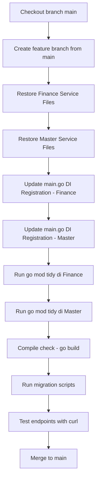

# Plan: Backup Code dari Branch QA & Restore ke Branch Main

## Tanggal: 2026-03-17
## Scope: Service Finance & Master

---

## 1. Endpoint Mapping

### Finance Service - Expense Type Domain

| Method | Endpoint | Handler | Route Group |
|--------|----------|---------|-------------|
| GET | `/v1/expense-type` | `List` | `/v1/expense-type` |
| POST | `/v1/expense-type` | `Create` | `/v1/expense-type` |
| PATCH | `/v1/expense-type/:expense_type_id` | `Update` | `/v1/expense-type` |
| DELETE | `/v1/expense-type/:expense_type_id` | `Delete` | `/v1/expense-type` |

> **Catatan**: Route path di code adalah `/v1/expense-type` bukan `/v1/expense_type`

### Master Service - Survey Template Domain

| Method | Endpoint | Handler | Route Group |
|--------|----------|---------|-------------|
| GET | `/v1/survey_template` | `List` | `/v1/survey_template` |
| GET | `/v1/survey_template/:survey_template_id` | `Detail` | `/v1/survey_template` |
| POST | `/v1/survey_template` | `Create` | `/v1/survey_template` |
| PUT | `/v1/survey_template/:survey_template_id` | `Update` | `/v1/survey_template` |
| DELETE | `/v1/survey_template/:survey_template_id` | `Delete` | `/v1/survey_template` |

> **Catatan**: Delete route ada di survey_template_controller.go line 34, bukan di `/v1/template_survey`

### Master Service - Survey Domain

| Method | Endpoint | Handler | Route Group |
|--------|----------|---------|-------------|
| GET | `/v1/survey` | `List` | `/v1/survey` |
| GET | `/v1/survey/:survey_id` | `Detail` | `/v1/survey` |
| POST | `/v1/survey` | `Create` | `/v1/survey` |
| PUT | `/v1/survey/:survey_id` | `Update` | `/v1/survey` |
| PATCH | `/v1/survey/:survey_id` | `Deactivate` | `/v1/survey` |

### Master Service - Outlet List Domain

| Method | Endpoint | Handler | Route Group |
|--------|----------|---------|-------------|
| GET | `/v1/outlet-list` | `OutletListApproval` | `/v1/outlet-list` |
| PATCH | `/v1/outlet-list/approval` | `ApproveOutletList` | `/v1/outlet-list` |

> **Catatan**: Route path di code adalah `/v1/outlet-list` bukan `/v1/outlet_list`

---

## 2. Daftar File yang Perlu Di-Backup dari Branch QA

### A. Finance Service - Expense Type

| Layer | File Path | Keterangan |
|-------|-----------|------------|
| Controller | `finance/controller/expense_controller.go` | CRUD expense type |
| Service | `finance/service/expense_service.go` | Business logic expense type |
| Repository | `finance/repository/expense_repository.go` | Data access expense type |
| Entity | `finance/entity/expense.go` | DTOs - request/response |
| Model | `finance/model/expense_type.go` | GORM model - ExpenseType, ExpenseTypeList |
| Migration | `finance/migration/acf.expense_type/add_expense_type_fields.sql` | DDL changes |
| Migration | `finance/migration/acf.expense_type/drop_expense_type_source.sql` | DDL cleanup |
| Migration | `finance/migration/acf.expense_type/rollback_expense_type_fields.sql` | DDL rollback |
| Main | `finance/main.go` | DI registration - lines ~57, ~97, ~131 |

### B. Master Service - Survey Template

| Layer | File Path | Keterangan |
|-------|-----------|------------|
| Controller | `master/controller/survey_template_controller.go` | CRUD survey template |
| Service | `master/service/survey_template_service.go` | Business logic survey template |
| Repository | `master/repository/survey_template_repository.go` | Data access survey template - sqlx |
| Repository | `master/repository/question_template_repository.go` | Question template CRUD - sqlx |
| Repository | `master/repository/q_option_template_repository.go` | Question option template - sqlx |
| Entity | `master/entity/survey_template.go` | DTOs survey template |
| Model | `master/model/survey_template.go` | DB model survey template |
| Model | `master/model/question_template.go` | DB model question template |
| Model | `master/model/q_option_template.go` | DB model question option template |
| Migration | `master/migration/mst.survey_template/001_create_tables.sql` | DDL create tables |

### C. Master Service - Survey

| Layer | File Path | Keterangan |
|-------|-----------|------------|
| Controller | `master/controller/survey_controller.go` | CRUD + deactivate survey |
| Service | `master/service/survey_service.go` | Business logic survey |
| Repository | `master/repository/survey_repository.go` | Data access survey + areas + outlets + details - sqlx |
| Entity | `master/entity/survey.go` | DTOs survey |
| Model | `master/model/survey.go` | DB model survey |
| Model | `master/model/survey_area.go` | DB model survey area |
| Model | `master/model/survey_outlet.go` | DB model survey outlet |
| Model | `master/model/survey_detail.go` | DB model survey detail |
| Migration | `master/migration/mst.survey/001_create_tables.sql` | DDL create tables |

### D. Master Service - Outlet List

| Layer | File Path | Keterangan |
|-------|-----------|------------|
| Controller | `master/controller/outlet_controller.go` | OutletListApproval + ApproveOutletList - lines 840-922 |
| Service | `master/service/outlet_service.go` | OutletListApproval + ApproveOutletList methods |
| Repository | `master/repository/outlet_repository.go` | FindAllOutletCrByStatus + related methods |
| Entity | `master/entity/outlet.go` | OutletListApprovalQueryFilter + OutletListApprovalRequest |
| Model | `master/model/outlet.go` | OutletCrList + related models |
| Migration | `master/migration/mst.outlet_cr/create_outlet_cr_tables.sql` | DDL outlet CR tables |

### E. Main.go Registration Lines

| Service | File | Keterangan |
|---------|------|------------|
| Finance | `finance/main.go` | Repository, Service, Controller initialization + route registration |
| Master | `master/main.go` | Repository, Service, Controller initialization + route registration |

---

## 3. Backup Strategy

### Struktur Backup Directory

```
backup/
  qa_backup_20260317/
    finance/
      controller/
        expense_controller.go
      service/
        expense_service.go
      repository/
        expense_repository.go
      entity/
        expense.go
      model/
        expense_type.go
      migration/
        acf.expense_type/
          add_expense_type_fields.sql
          drop_expense_type_source.sql
          rollback_expense_type_fields.sql
      main.go
    master/
      controller/
        survey_template_controller.go
        survey_controller.go
        outlet_controller.go
      service/
        survey_template_service.go
        survey_service.go
        outlet_service.go
      repository/
        survey_template_repository.go
        question_template_repository.go
        q_option_template_repository.go
        survey_repository.go
        outlet_repository.go
      entity/
        survey_template.go
        survey.go
        outlet.go
      model/
        survey_template.go
        question_template.go
        q_option_template.go
        survey.go
        survey_area.go
        survey_outlet.go
        survey_detail.go
        outlet.go
      migration/
        mst.survey_template/
          001_create_tables.sql
        mst.survey/
          001_create_tables.sql
        mst.outlet_cr/
          create_outlet_cr_tables.sql
      main.go
```

### Backup Steps

1. **Checkout branch qa** dan pastikan branch up-to-date
2. **Copy semua file** yang teridentifikasi ke `backup/qa_backup_20260317/`
3. **Verifikasi** semua file ter-copy dengan benar
4. **Snapshot main.go** untuk kedua service - fokus pada section DI registration

---

## 4. Restore Plan: QA → Main

### Pre-conditions
- Branch `main` sudah di-checkout
- Branch `main` sudah up-to-date dari remote
- Backup dari branch `qa` sudah lengkap dan terverifikasi

### Restore Flow



### Step-by-Step Restore

#### Phase 1: Persiapan
1. `git checkout main && git pull origin main`
2. `git checkout -b feature/restore-qa-features-to-main`

#### Phase 2: Restore Finance Service
1. Copy `expense_controller.go` → `finance/controller/`
2. Copy `expense_service.go` → `finance/service/`
3. Copy `expense_repository.go` → `finance/repository/`
4. Copy `expense.go` → `finance/entity/`
5. Copy `expense_type.go` → `finance/model/`
6. Copy migration files → `finance/migration/acf.expense_type/`
7. Update `finance/main.go`:
   - Tambahkan `expenseRepository` initialization
   - Tambahkan `expenseService` initialization
   - Tambahkan `expenseController` initialization
   - Tambahkan `expenseController.Route(app)` registration
8. Run `cd finance && go mod tidy && go build .`

#### Phase 3: Restore Master Service
1. Copy survey template files:
   - `survey_template_controller.go` → `master/controller/`
   - `survey_template_service.go` → `master/service/`
   - `survey_template_repository.go` → `master/repository/`
   - `question_template_repository.go` → `master/repository/`
   - `q_option_template_repository.go` → `master/repository/`
   - `survey_template.go` → `master/entity/`
   - `survey_template.go` → `master/model/`
   - `question_template.go` → `master/model/`
   - `q_option_template.go` → `master/model/`
2. Copy survey files:
   - `survey_controller.go` → `master/controller/`
   - `survey_service.go` → `master/service/`
   - `survey_repository.go` → `master/repository/`
   - `survey.go` → `master/entity/`
   - `survey.go` → `master/model/`
   - `survey_area.go` → `master/model/`
   - `survey_outlet.go` → `master/model/`
   - `survey_detail.go` → `master/model/`
3. Copy outlet list related changes:
   - Update `outlet_controller.go` → pastikan OutletListApproval dan ApproveOutletList ada
   - Update `outlet_service.go` → pastikan method terkait ada
   - Update `outlet_repository.go` → pastikan FindAllOutletCrByStatus ada
   - Update `outlet.go` entity → pastikan OutletListApprovalQueryFilter ada
   - Update `outlet.go` model → pastikan OutletCrList ada
4. Copy migration files → `master/migration/`
5. Update `master/main.go`:
   - Tambahkan survey template DI registration
   - Tambahkan survey DI registration
   - Tambahkan outlet list related DI jika baru
   - Tambahkan route registration
6. Run `cd master && go mod tidy && go build .`

#### Phase 4: Database Migration
1. Jalankan `finance/migration/acf.expense_type/add_expense_type_fields.sql`
2. Jalankan `master/migration/mst.survey_template/001_create_tables.sql`
3. Jalankan `master/migration/mst.survey/001_create_tables.sql`
4. Jalankan `master/migration/mst.outlet_cr/create_outlet_cr_tables.sql`

#### Phase 5: Verifikasi
1. Start finance service: `cd finance && go run main.go`
2. Test finance endpoints:
   - `GET localhost:9005/v1/expense-type?page=1&limit=5&sort=created_date:desc`
   - `POST localhost:9005/v1/expense-type`
   - `PATCH localhost:9005/v1/expense-type/1`
   - `DELETE localhost:9005/v1/expense-type/1`
3. Start master service: `cd master && go run main.go`
4. Test master endpoints:
   - `GET localhost:9002/v1/survey_template?page=1&limit=10`
   - `GET localhost:9002/v1/survey_template/1`
   - `POST localhost:9002/v1/survey_template`
   - `PUT localhost:9002/v1/survey_template/1`
   - `DELETE localhost:9002/v1/survey_template/1`
   - `GET localhost:9002/v1/survey?page=1&limit=10`
   - `GET localhost:9002/v1/survey/1`
   - `POST localhost:9002/v1/survey`
   - `PUT localhost:9002/v1/survey/1`
   - `PATCH localhost:9002/v1/survey/1`
   - `GET localhost:9002/v1/outlet-list?page=1&limit=10`
   - `PATCH localhost:9002/v1/outlet-list/approval`

#### Phase 6: Commit & Merge
1. `git add .`
2. `git commit -m "feat: restore expense_type, survey_template, survey, outlet_list features from qa"`
3. Create PR / merge to main

---

## 5. Catatan Penting

### Perbedaan Pattern
- **Finance expense**: menggunakan **GORM** pattern - `*gorm.DB`, `extractTx()`, `model()` helper
- **Master survey/survey_template**: menggunakan **sqlx** pattern - `*sqlx.DB`, `BeginTx()`, raw SQL queries
- **Master outlet_list**: berada di dalam `outlet_controller.go` yang sudah sangat besar - berhati-hati saat merge

### Dependencies
- Survey menggunakan `sqlx` bukan `gorm` - pastikan `go.mod` di master sudah include `github.com/jmoiron/sqlx`
- Outlet list terkait erat dengan outlet controller yang sudah ada - pastikan TIDAK menimpa logic outlet yang sudah ada di main

### Risiko
- `outlet_controller.go` sangat besar dan mungkin ada perubahan lain di main - perlu careful merge
- `outlet_service.go` juga sangat besar - perlu diff comparison antara qa dan main
- `outlet_repository.go` juga besar - perlu diff comparison

### Mitigasi
- Untuk outlet: lakukan **diff** antara qa dan main sebelum merge, hanya tambahkan method/handler yang baru
- Untuk survey & survey_template: ini kemungkinan file baru, bisa langsung copy
- Untuk expense_type: ini kemungkinan file baru, bisa langsung copy
