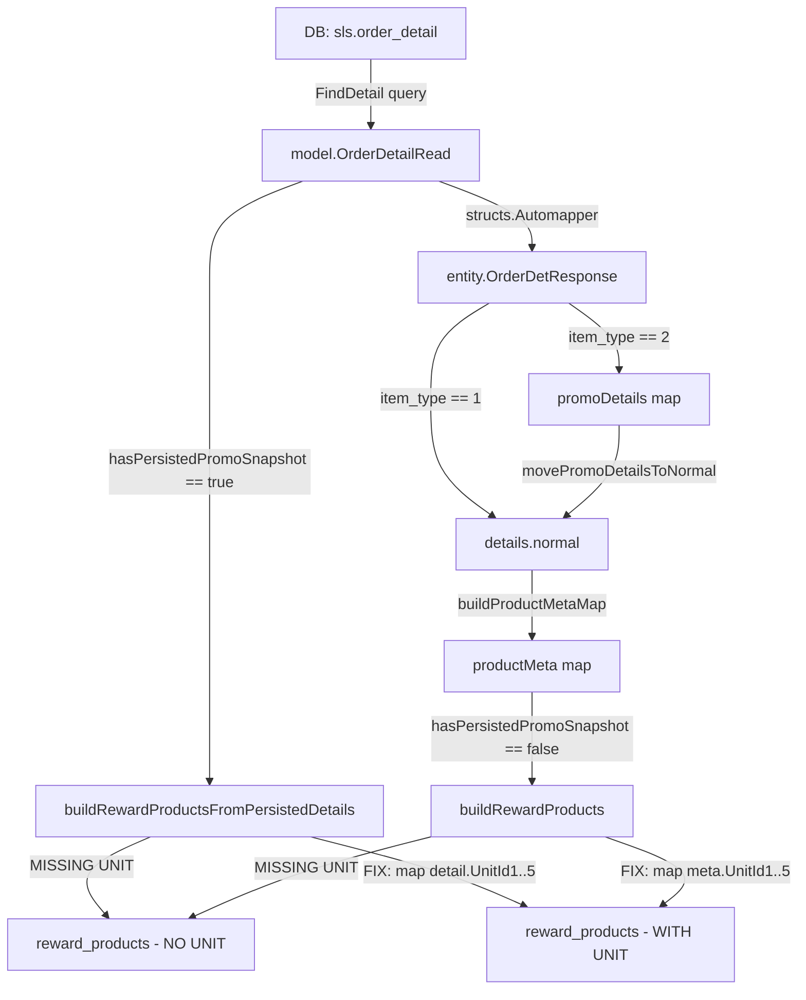

# Plan: Fix Missing `unit` on Reward Products Response

## Bug Summary

Endpoint `GET /v2/orders/:order_no` tidak mengirim field `unit_id1..unit_id5` pada `reward_products` di dalam response groups `details`, `details_final`, dan `purchase_details`.

Contoh kasus: `GET /v2/orders/SO2603150001` — item promo di `details.normal` memiliki unit, tetapi item di `reward_products` tidak.

## Root Cause

Ada **dua sumber masalah** yang saling terkait:

### RC-1: DTO `OrderRewardProductResponse` tidak punya field unit

File: [`sales/entity/order_detail.go:345-361`](sales/entity/order_detail.go:345)

```go
type OrderRewardProductResponse struct {
    ProID      int     `json:"pro_id"`
    ProCode    string  `json:"pro_code"`
    ProName    string  `json:"pro_name"`
    SellPrice1 float64 `json:"sell_price1"`
    // ... qty, promo fields
    // MISSING: UnitId1..UnitId5
}
```

### RC-2: Builder functions tidak memetakan unit

1. [`buildRewardProducts()`](sales/service/order_service.go:1190) — runtime promo consult path
   - Membentuk `OrderRewardProductResponse` tanpa unit fields
   - Memiliki akses ke `productMeta` yang berisi `OrderDetResponse` dengan unit, tapi tidak digunakan

2. [`buildRewardProductsFromPersistedDetails()`](sales/service/order_service.go:1378) — persisted snapshot path
   - Membentuk `OrderRewardProductResponse` dari `model.OrderDetailRead` yang punya `UnitId1..UnitId5`
   - Tapi tidak memetakan field-field tersebut ke response

### Bukti dari Response Aktual

Response SO2603150001 menunjukkan:
- `details.normal[2]` — promo item `pro_id=723`, `is_product_promotion=true` → **unit_id1="PCS"** ✅
- `details_final.normal[3]` — promo item `item_type=2`, `pro_id=723` → **unit_id1=null** (DB memang null untuk reward row)
- `details_final.reward_products[0]` — `pro_id=723` → **tidak ada field unit sama sekali** ❌

## Files to Modify

| # | File | Perubahan |
|---|------|-----------|
| 1 | `sales/entity/order_detail.go` | Tambah `UnitId1..UnitId5` ke `OrderRewardProductResponse` |
| 2 | `sales/service/order_service.go` | Map unit di `buildRewardProducts()` dan `buildRewardProductsFromPersistedDetails()` |
| 3 | `sales/service/order_service_test.go` | Tambah test untuk memastikan unit ada di reward products |

## Implementation Steps

### Step 1: Extend `OrderRewardProductResponse` struct

Di [`sales/entity/order_detail.go`](sales/entity/order_detail.go:345), tambahkan field unit setelah `ProName`:

```go
type OrderRewardProductResponse struct {
    ProID      int     `json:"pro_id"`
    ProCode    string  `json:"pro_code"`
    ProName    string  `json:"pro_name"`
    UnitId1    *string `json:"unit_id1"`
    UnitId2    *string `json:"unit_id2"`
    UnitId3    *string `json:"unit_id3"`
    UnitId4    *string `json:"unit_id4"`
    UnitId5    *string `json:"unit_id5"`
    SellPrice1 float64 `json:"sell_price1"`
    // ... rest unchanged
}
```

### Step 2: Map unit di `buildRewardProducts()`

Di [`sales/service/order_service.go:1212-1228`](sales/service/order_service.go:1212), tambahkan mapping unit dari `meta`:

```go
rewardProducts = append(rewardProducts, entity.OrderRewardProductResponse{
    ProID:      rewardProduct.ProID,
    ProCode:    meta.ProCode,
    ProName:    meta.ProName,
    UnitId1:    meta.UnitId1,    // NEW
    UnitId2:    meta.UnitId2,    // NEW
    UnitId3:    meta.UnitId3,    // NEW
    UnitId4:    meta.UnitId4,    // NEW
    UnitId5:    meta.UnitId5,    // NEW
    SellPrice1: getValueOrDefault(meta.SellPrice1, 0),
    // ... rest unchanged
})
```

Note: Saat fallback ke `findProductFn`, `meta` yang dibentuk dari `model.ProductRead` belum punya unit. Perlu cek apakah `model.ProductRead` memiliki `UnitId1..UnitId5`. Jika tidak, field unit akan nil — ini acceptable karena data tetap dikirim.

### Step 3: Map unit di `buildRewardProductsFromPersistedDetails()`

Di [`sales/service/order_service.go:1386-1390`](sales/service/order_service.go:1386), tambahkan mapping unit dari `detail`:

```go
reward := entity.OrderRewardProductResponse{
    ProID:   detail.ProId,
    ProCode: detail.ProCode,
    ProName: detail.ProName,
    UnitId1: detail.UnitId1,    // NEW
    UnitId2: detail.UnitId2,    // NEW
    UnitId3: detail.UnitId3,    // NEW
    UnitId4: detail.UnitId4,    // NEW
    UnitId5: detail.UnitId5,    // NEW
}
```

### Step 4: Cek apakah `model.ProductRead` punya unit fields

Jika `model.ProductRead` tidak memiliki `UnitId1..UnitId5`, maka saat `buildRewardProducts()` fallback ke `findProductFn` dan membentuk `meta` dari `model.ProductRead`, unit akan nil. Ini perlu ditambahkan juga agar konsisten. Tapi jika field tidak ada di tabel `mst.m_product`, biarkan nil.

### Step 5: Tambah unit test

Di [`sales/service/order_service_test.go`](sales/service/order_service_test.go), tambahkan test case:

1. **Test `buildRewardProducts` maps unit from productMeta** — memastikan unit dari meta item utama terbawa ke reward response
2. **Test `buildRewardProductsFromPersistedDetails` maps unit from detail** — memastikan unit dari persisted detail terbawa
3. **Test reward products unit nil when source is nil** — memastikan response tetap valid saat source unit null
4. **Test mixed order: regular items punya unit, reward items juga punya unit** — integrasi

### Step 6: Verifikasi endpoint

Setelah fix diterapkan, restart sales service dan hit:
```
GET /v2/orders/SO2603150001
```
Verifikasi bahwa:
- `details.reward_products[0]` sekarang punya `unit_id1..unit_id5`
- `details_final.reward_products[0]` juga punya `unit_id1..unit_id5`
- `purchase_details.reward_products[0]` juga punya `unit_id1..unit_id5`
- Regular items di `details.normal` tetap tidak berubah

## Data Flow Diagram



## Edge Cases

| Case | Handling |
|------|----------|
| Reward item unit null di DB | Response kirim `unit_id1: null` — field tetap ada, value null |
| Fallback ke findProductFn tanpa unit | Unit akan nil — acceptable, field tetap terkirim |
| Regular + promo campuran | Regular items tidak terpengaruh, reward items mendapat unit |
| Backward compatibility FE | Additive change — FE lama ignore extra fields |
| Reward product dari promo consult runtime | Unit diambil dari productMeta yang berasal dari details.normal |

## Safety Checklist

- [x] Perubahan additive — tidak menghapus/rename field existing
- [x] Regular item flow tidak diubah
- [x] Promo item yang di-flatten ke normal tidak diubah
- [x] Hanya menambah field baru ke `OrderRewardProductResponse`
- [x] Builder functions hanya menambah assignment, tidak mengubah logic existing
- [x] Backward compatible untuk client lama
