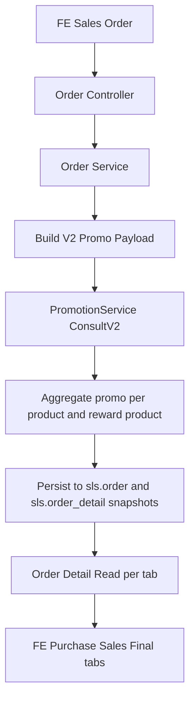

# Sales Order Promo V2 Migration Plan

## Objective

Migrasi seluruh fitur Promotion pada Sales Order di [`sales`](../sales/main.go) menjadi **promo v2 only** dengan target berikut:

- seluruh kalkulasi promo Sales Order hanya memakai [`PromotionService.ConsultV2()`](../sales/service/promotion_service.go:2261)
- **tanpa backward compatibility** untuk engine promo legacy [`PromotionService.ConsultPromotion()`](../sales/service/promotion_service.go:591)
- hasil nilai promo Sales Order harus konsisten dengan skenario referensi pada [`docs/test promo integrasi sales order - Request mas angga.csv`](../docs/test%20promo%20integrasi%20sales%20order%20-%20Request%20mas%20angga.csv)
- workflow PROMO tetap mengikuti spesifikasi pada bagian [`PROMO`](../docs/Sales%20Order%20Enhancement_BE.md) di [`docs/Sales Order Enhancement_BE.md`](../docs/Sales%20Order%20Enhancement_BE.md)

## Validated Business Baseline

Validasi runtime terhadap data promo v2 remote dan payload CSV menunjukkan bahwa hasil consult v2 sudah sesuai untuk skenario berikut bila memakai `outlet_id` yang benar:

- [`SO2603120003`](../docs/test%20promo%20integrasi%20sales%20order%20-%20Request%20mas%20angga.csv:3)
- [`SO2603120004`](../docs/test%20promo%20integrasi%20sales%20order%20-%20Request%20mas%20angga.csv:16)
- [`SO2603120005`](../docs/test%20promo%20integrasi%20sales%20order%20-%20Request%20mas%20angga.csv:27)
- [`SO2603120006`](../docs/test%20promo%20integrasi%20sales%20order%20-%20Request%20mas%20angga.csv:41)

Artinya:

- **data promo v2 remote sudah layak dijadikan source of truth**
- gap utama ada di **code path Sales Order**, bukan di data promo v2

## Required End State

### Promotion source of truth

Hanya gunakan:

- [`PromotionService.ConsultV2()`](../sales/service/promotion_service.go:2261)

Jangan lagi gunakan:

- [`PromotionService.ConsultPromotion()`](../sales/service/promotion_service.go:591)
- [`orderServiceImpl.ConsultPromotionBeforeStore()`](../sales/service/order_service.go:773)
- [`OrderService.SetConsultPromotionRequest()`](../sales/service/order_service.go:731)
- seluruh entity legacy consult v1 yang hanya dipakai untuk order flow lama

### Workflow yang wajib dipertahankan

Mengikuti bagian PROMO di [`docs/Sales Order Enhancement_BE.md`](../docs/Sales%20Order%20Enhancement_BE.md):

1. **Create Sales Order** tetap consult promo sebelum simpan order di bagian [`Create Sales Order`](../docs/Sales%20Order%20Enhancement_BE.md:1396)
2. **Detail Sales Order** tetap memakai pola hash/signature per tab dan consult per tab seperti sequence di [`Detail Sales Order include Promo`](../docs/Sales%20Order%20Enhancement_BE.md:208)
3. **Edit Sales Order - Tab Sales Order** tetap membandingkan promo lama vs promo baru dan menyesuaikan stock promo product di bagian [`Edit Sales Order - Tab Sales Order`](../docs/Sales%20Order%20Enhancement_BE.md:1606)
4. **Edit Sales Order - Tab Final Order** juga tetap membandingkan promo lama vs promo baru sesuai [`Edit Sales Order - Tab Final Order`](../docs/Sales%20Order%20Enhancement_BE.md:1660)
5. Mapping field promo snapshot di order header dan order detail tetap mengikuti tabel pada bagian [`PROMO`](../docs/Sales%20Order%20Enhancement_BE.md:1354)

## Current Code Gaps

### 1. Controller create update final masih consult legacy

Masih ada pemanggilan langsung ke legacy promo di:

- [`OrderController.Create()`](../sales/controller/order_controller.go:154)
- [`OrderController.Update()`](../sales/controller/order_controller.go:701)
- [`OrderController.UpdateFinal()`](../sales/controller/order_controller.go:818)

Ini bertentangan dengan target v2-only.

### 2. Write flow Sales Order masih dual-path

[`orderServiceImpl.Store()`](../sales/service/order_service.go:378) masih punya selector `usePromoV2` di [`orderServiceImpl.Store()`](../sales/service/order_service.go:381), sehingga Sales Order belum deterministik v2-only.

### 3. Update dan update final masih memakai transform legacy

Masih bergantung pada:

- [`orderServiceImpl.ConsultPromotionBeforeStore()`](../sales/service/order_service.go:773)
- entity legacy consult pada [`sales/entity/order.go`](../sales/entity/order.go)

### 4. Detail workflow sudah dekat ke spec, tetapi masih menyisakan fallback legacy

[`orderServiceImpl.DetailV2()`](../sales/service/order_service.go:2520) sudah memiliki pola:

- signature per tab
- single consult bila tab identik
- multi consult bila tab berbeda

Namun masih ada `legacyFallback` di [`orderServiceImpl.DetailV2()`](../sales/service/order_service.go:2937) yang harus dihapus karena targetnya tanpa backward compatibility.

### 5. Snapshot promo create dan edit belum sepenuhnya seragam

Ada helper v2 yang sudah baik seperti:

- [`buildCreateOrderPromoPayload()`](../sales/service/order_service.go:1512)
- [`aggregatePromoByProduct()`](../sales/service/order_service.go:1189)
- [`buildFinalRemarks()`](../sales/service/order_service.go:1488)
- [`buildCreateOrderRewardDetails()`](../sales/service/order_service.go:1618)
- [`syncRewardProductState()`](../sales/service/order_service.go:1886)

Tetapi create, update, update final, dan enhance belum dipaksa melalui arsitektur helper yang sama.

## Target Architecture

## Migration Scope

### Included

- create Sales Order via [`POST /sales/v1/orders`](../docs/Sales%20Order%20Enhancement_BE.md:1402)
- detail Sales Order via [`GET /sales/v2/orders/{ro_no}`](../docs/Sales%20Order%20Enhancement_BE.md:86)
- edit Sales Order tab purchase sales final via [`PATCH /sales/v1/orders/enhance/{ro_no}`](../docs/Sales%20Order%20Enhancement_BE.md:1609)
- update promo snapshot field di `sls.order`
- update promo snapshot field di `sls.order_detail`
- stock adjustment untuk reward product pada create dan edit
- discount recalculation yang mempertimbangkan promo seperti rumus pada [`Fixing rumus discount`](../docs/Sales%20Order%20Enhancement_BE.md:1600)

### Explicitly excluded

- backward compatibility engine promo v1
- fallback pembacaan promo dari engine legacy
- wrapper legacy consult endpoint untuk Sales Order

## Canonical Business Rules

### A. Create Sales Order

Sesuai flow di [`Create Sales Order`](../docs/Sales%20Order%20Enhancement_BE.md:1396):

1. FE kirim payload order ke [`POST /sales/v1/orders`](../docs/Sales%20Order%20Enhancement_BE.md:1402)
2. Service membangun payload consult v2 dari:
   - `ro_date`
   - `outlet_id`
   - `salesman_id`
   - `wh_id`
   - `details.normal[].pro_id`
   - `details.normal[].qty1`
   - `details.normal[].qty2`
   - `details.normal[].qty3`
   - `gross_value = qty1*sell_price1 + qty2*sell_price2 + qty3*sell_price3`
3. Panggil [`PromotionService.ConsultV2()`](../sales/service/promotion_service.go:2261)
4. Mapping hasil consult ke:
   - header `promo_remarks_so`
   - header `promo_remarks_final`
   - detail `promo_so1..5`
   - detail `promo_final1..5`
   - detail `promo_remarks_so`
   - detail `promo_remarks_final`
   - detail `is_product_promotion_so`
   - detail `is_product_promotion_final`
5. Jika reward product ada:
   - insert reward product ke `sls.order_detail` sebagai `item_type = 2`
   - adjust `inv.stock`
   - adjust `inv.warehouse_stock`
6. Jalankan discount calculation dengan formula baru setelah promo

### B. Detail Sales Order per tab

Sesuai sequence di [`Detail Sales Order include Promo`](../docs/Sales%20Order%20Enhancement_BE.md:208):

1. Fetch aggregate order dan tiga tab:
   - `details.normal`
   - `details_final.normal`
   - `purchase_details.normal`
2. Generate signature per tab
3. Jika semua tab identik:
   - cukup satu kali consult v2
   - inject hasil sama ke ketiga tab
4. Jika tab berbeda:
   - consult v2 per tab
   - inject masing-masing hasil sesuai tab
5. Untuk response detail, field promo harus disajikan sebagai:
   - `promo1..promo5`
   - `promo_total`
   - `remarks`
   - `final_remarks`
   - `reward_products`
6. Source field tetap berasal dari snapshot promo yang tersimpan sesuai mapping di bagian [`PROMO`](../docs/Sales%20Order%20Enhancement_BE.md:1360)

### C. Edit Sales Order - tab Sales Order

Sesuai flow di [`Edit Sales Order - Tab Sales Order`](../docs/Sales%20Order%20Enhancement_BE.md:1606):

1. Fetch existing order detail dan existing promo reward product state
2. Terapkan perubahan qty dan price pada tab Sales Order
3. Rebuild consult payload dari state tab Sales Order yang baru
4. Panggil consult v2
5. Hitung delta promo lama vs promo baru
6. Update snapshot ke:
   - `promo_so1..5`
   - `promo_final1..5`
   - `promo_remarks_so`
   - `promo_remarks_final`
   - `is_product_promotion_so`
   - `is_product_promotion_final`
7. Jika reward product berubah:
   - adjust stock hanya berdasarkan delta
8. Recalculate:
   - `disc_value`
   - `disc_value_final`
   - `vat_value`
   - `vat_value_final`
   - `amount`
   - `amount_final`

### D. Edit Sales Order - tab Final Order

Sesuai flow di [`Edit Sales Order - Tab Final Order`](../docs/Sales%20Order%20Enhancement_BE.md:1660):

1. Fetch existing final tab detail
2. Terapkan perubahan qty final dan price final
3. Rebuild consult payload dari state final tab
4. Panggil consult v2
5. Hitung delta promo lama vs promo baru
6. Update hanya field final snapshot:
   - `promo_final1..5`
   - `promo_remarks_final`
   - `is_product_promotion_final`
7. Adjust stock reward product berdasarkan delta final tab
8. Recalculate final values:
   - `disc_value_final`
   - `vat_value_final`
   - `amount_final`

### E. Discount formula

Gunakan formula business rule pada [`Fixing rumus discount`](../docs/Sales%20Order%20Enhancement_BE.md:1600):

- `gross_item = qty1*sell_price1 + qty2*sell_price2 + qty3*sell_price3`
- `promo = promo1 + promo2 + promo3 + promo4 + promo5`
- `disc_value_item = (gross_item - promo) * (disc_item / 100)`

Artinya discount harus dihitung **setelah promo**, bukan sebelum promo.

## Technical Design

### 1. Remove legacy promo path completely

Hapus dari order flow:

- [`PromotionService.ConsultPromotion()`](../sales/service/promotion_service.go:591)
- [`orderServiceImpl.ConsultPromotionBeforeStore()`](../sales/service/order_service.go:773)
- [`OrderService.SetConsultPromotionRequest()`](../sales/service/order_service.go:731)
- semua request mapping legacy consult dari [`sales/entity/order.go`](../sales/entity/order.go)

### 2. Introduce one V2 orchestration layer for Sales Order

Buat satu service orchestration terpusat, misalnya secara konsep:

- `buildSalesOrderPromoPayloadForCreate`
- `buildSalesOrderPromoPayloadForSalesTab`
- `buildSalesOrderPromoPayloadForFinalTab`
- `applyPromoSnapshotToSalesOrder`
- `reconcileRewardProductStockDelta`
- `recalculateDiscountAndVatAfterPromo`

Semua create dan edit wajib melewati helper ini.

### 3. Persisted snapshot model stays the same

Tetap gunakan field snapshot promo pada `sls.order` dan `sls.order_detail` sesuai dokumen [`PROMO`](../docs/Sales%20Order%20Enhancement_BE.md:1354), karena workflow FE sudah bergantung pada field ini.

### 4. No runtime legacy recomputation

Pada read detail:

- jangan consult legacy
- jangan gunakan fallback lama
- seluruh inject promo berasal dari consult v2 atau snapshot v2

### 5. Reward product stock delta must be deterministic

Create dan edit harus memakai logika delta, bukan delete-all-reinsert secara buta, agar konsisten dengan workflow perbandingan promo lama vs baru di [`Edit Sales Order - Tab Sales Order`](../docs/Sales%20Order%20Enhancement_BE.md:1622) dan [`Edit Sales Order - Tab Final Order`](../docs/Sales%20Order%20Enhancement_BE.md:1676)

## File-Level Change Plan

### Controllers

Perbarui:

- [`sales/controller/order_controller.go`](../sales/controller/order_controller.go)

Perubahan:

- hapus consult legacy dari create update update-final
- controller hanya parse validate lalu delegasi ke order service

### Services

Perbarui utama:

- [`sales/service/order_service.go`](../sales/service/order_service.go)
- [`sales/service/promotion_service.go`](../sales/service/promotion_service.go)

Perubahan:

- jadikan v2 sebagai satu-satunya jalur promo Sales Order
- hapus branch legacy di create update update-final
- pertahankan workflow hash/signature detail namun consult hanya v2
- sesuaikan recalculation discount VAT amount agar mengikuti dokumen

### Repositories

Perbarui bila perlu:

- [`sales/repository/promotionV2_repository.go`](../sales/repository/promotionV2_repository.go)
- [`sales/repository/order_repository.go`](../sales/repository/order_repository.go)
- repository stock terkait reward product delta

Perubahan:

- pastikan query outlet criteria dan reward product cukup untuk semua skenario CSV
- pastikan update snapshot order detail bisa parsial per tab

### Entities

Perbarui:

- [`sales/entity/order.go`](../sales/entity/order.go)

Perubahan:

- rapikan entity yang berkaitan dengan promo snapshot response detail
- tandai entity consult legacy yang sudah tidak dipakai oleh Sales Order

### main wiring

Perbarui:

- [`sales/main.go`](../sales/main.go)

Perubahan:

- jika order flow tak lagi perlu promo legacy repository, sederhanakan constructor dependency untuk order service

## Implementation Sequence

1. hapus consult legacy dari controller Sales Order
2. refactor create Sales Order menjadi consult v2-only
3. refactor update Sales Order menjadi consult v2-only
4. refactor update final menjadi consult v2-only
5. seragamkan helper payload dan snapshot v2 untuk create edit final
6. rapikan detail Sales Order agar hanya memakai v2 workflow sesuai hash/signature doc
7. implementasikan delta reward product stock yang stabil
8. sesuaikan rumus discount setelah promo
9. hapus kode dan interface legacy yang sudah tidak dipakai Sales Order
10. validasi ulang seluruh skenario CSV

## Mandatory Validation Scenarios

Gunakan referensi berikut sebagai acceptance test utama:

- [`SO2603120003`](../docs/test%20promo%20integrasi%20sales%20order%20-%20Request%20mas%20angga.csv:3)
- [`SO2603120004`](../docs/test%20promo%20integrasi%20sales%20order%20-%20Request%20mas%20angga.csv:16)
- [`SO2603120005`](../docs/test%20promo%20integrasi%20sales%20order%20-%20Request%20mas%20angga.csv:27)
- [`SO2603120006`](../docs/test%20promo%20integrasi%20sales%20order%20-%20Request%20mas%20angga.csv:41)

### Expected business outputs

#### `SO2603120003`
- promo remarks: `promostrata1`
- promo barang: `2.000.000`
- promo uang: `0`

#### `SO2603120004`
- promo remarks: `promostrata1`
- promo barang: `2.000.000`
- promo uang: `0`

#### `SO2603120005`
- promo remarks: `1112`, `BUYBUYBUY`
- promo barang: `4.000.000`
- promo uang: `1.840.000`

#### `SO2603120006`
- promo remarks: `1112`, `BUYBUYBUY`
- promo barang: `4.000.000`
- promo uang: `984.000`
- regular discount: `628.320`

## Definition of Done

Migrasi dianggap selesai jika seluruh kondisi berikut terpenuhi:

- tidak ada lagi code path Sales Order yang memanggil [`PromotionService.ConsultPromotion()`](../sales/service/promotion_service.go:591)
- create update final detail Sales Order hanya memakai consult v2
- tidak ada lagi fallback legacy pada detail Sales Order
- field snapshot promo pada `sls.order` dan `sls.order_detail` terisi konsisten sesuai dokumen [`PROMO`](../docs/Sales%20Order%20Enhancement_BE.md:1354)
- reward product stock delta berjalan benar saat create dan edit
- rumus discount setelah promo sesuai dokumen
- hasil create dan detail Sales Order konsisten dengan [`docs/test promo integrasi sales order - Request mas angga.csv`](../docs/test%20promo%20integrasi%20sales%20order%20-%20Request%20mas%20angga.csv)

## Recommendation

Plan ini siap dijadikan baseline implementasi. Fokus implementasi sebaiknya dimulai dari write flow Sales Order terlebih dahulu karena di sanalah legacy dan v2 masih bercampur, lalu dilanjutkan ke detail workflow dan stock delta reward product agar seluruh experience Sales Order menjadi konsisten dengan promo v2.