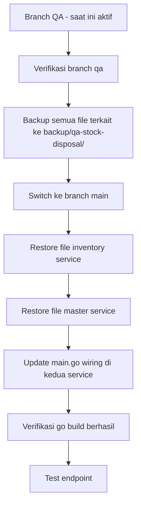
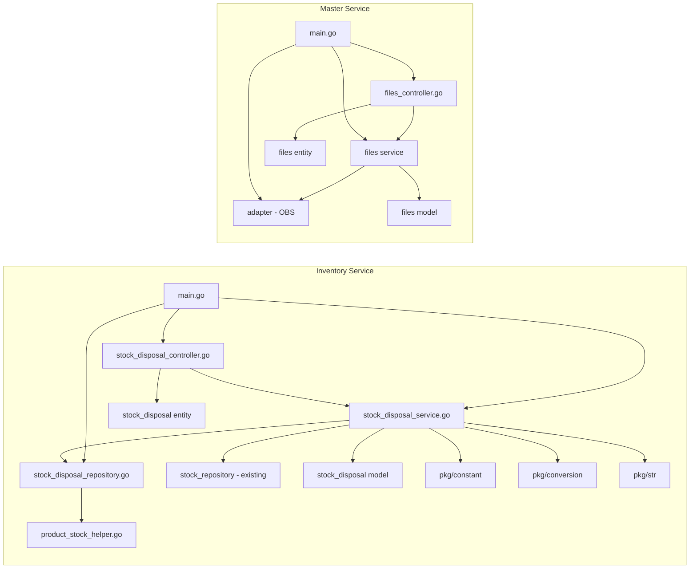

# Plan: Backup & Restore Stock Disposal Feature dari QA ke Main

## Konteks
Tujuan: Merge fitur **Stock Disposal** beserta endpoint pendukung dari branch `qa` ke branch `main` pada service **master** dan **inventory**.

## Endpoint yang Terlibat

| Service | Endpoint | Method | Fungsi |
|---------|----------|--------|--------|
| Master | `/v1/warehouses?q=&page=1&limit=70` | GET | List warehouse untuk lookup |
| Master | `/v1/suppliers?q=&page=1&limit=70` | GET | List supplier untuk lookup |
| Master | `/v1/files/uploads` | POST | Upload file ke OBS storage |
| Inventory | `/v1/stock-disposal?sort=created_date:desc&limit=5&page=1` | GET | List stock disposal |
| Inventory | `/v1/stock-disposal/:stock_disposal_id` | GET | Detail stock disposal |
| Inventory | `/v1/stock-disposal` | POST | Create stock disposal |
| Inventory | `/v1/stock-disposal/products` | GET | Product lookup untuk stock disposal |

## Alur Kerja



---

## FASE 1: Identifikasi File yang Perlu Backup

### Inventory Service - File Baru / Berubah

| Layer | File | Keterangan |
|-------|------|------------|
| Controller | `inventory/controller/stock_disposal_controller.go` | Route & handler stock disposal |
| Service | `inventory/service/stock_disposal_service.go` | Business logic stock disposal |
| Repository | `inventory/repository/stock_disposal_repository.go` | DB queries stock disposal |
| Repository | `inventory/repository/product_stock_helper.go` | Helper shared: BuildWarehouseStockTotalSubquery, BuildInTransitStockSubqueries, BuildQtyCalculationExpressions |
| Entity | `inventory/entity/stock_disposal.go` | Request/response DTOs |
| Model | `inventory/model/stock_disposal.go` | GORM model stock disposal + detail |
| Wiring | `inventory/main.go` | DI wiring untuk StockDisposalRepository, StockDisposalService, StockDisposalController |
| Constant | `inventory/pkg/constant/constant.go` | TR_CODE_STOCK_DISPOSAL, MAX_FILE_SIZE_BYTES, DATE_FORMAT_DISPLAY, DATE_FORMAT_DETAIL |
| Config | `inventory/go.mod` | Dependencies |
| Config | `inventory/go.sum` | Dependencies lock |

### Master Service - File Baru / Berubah

| Layer | File | Keterangan |
|-------|------|------------|
| Controller | `master/controller/files_controller.go` | Route & handler file upload |
| Controller | `master/controller/warehouse_controller.go` | Route & handler warehouse - mungkin ada perubahan |
| Controller | `master/controller/supplier_controller.go` | Route & handler supplier - mungkin ada perubahan |
| Service | `master/service/files.go` | FilesService interface & implementation |
| Entity | `master/entity/files.go` | UploadRequest, UploadResponse entities |
| Model | `master/model/files.go` | Upload model |
| Adapter | `master/adapter/` | OBS adapter untuk file upload |
| Wiring | `master/main.go` | DI wiring untuk FilesService, FilesController, ObsAdapter |
| Config | `master/go.mod` | Dependencies |
| Config | `master/go.sum` | Dependencies lock |

---

## FASE 2: Backup dari Branch QA

### Langkah-langkah:

1. **Verifikasi branch aktif**
   ```bash
   git branch --show-current
   ```
   Pastikan output: `qa`

2. **Buat folder backup**
   ```bash
   mkdir -p backup/qa-stock-disposal/inventory/{controller,service,repository,entity,model,pkg/constant}
   mkdir -p backup/qa-stock-disposal/master/{controller,service,entity,model,adapter}
   ```

3. **Copy file inventory service**
   ```bash
   cp inventory/controller/stock_disposal_controller.go backup/qa-stock-disposal/inventory/controller/
   cp inventory/service/stock_disposal_service.go backup/qa-stock-disposal/inventory/service/
   cp inventory/repository/stock_disposal_repository.go backup/qa-stock-disposal/inventory/repository/
   cp inventory/repository/product_stock_helper.go backup/qa-stock-disposal/inventory/repository/
   cp inventory/entity/stock_disposal.go backup/qa-stock-disposal/inventory/entity/
   cp inventory/model/stock_disposal.go backup/qa-stock-disposal/inventory/model/
   cp inventory/main.go backup/qa-stock-disposal/inventory/
   cp inventory/pkg/constant/constant.go backup/qa-stock-disposal/inventory/pkg/constant/
   cp inventory/go.mod backup/qa-stock-disposal/inventory/
   cp inventory/go.sum backup/qa-stock-disposal/inventory/
   ```

4. **Copy file master service**
   ```bash
   cp master/controller/files_controller.go backup/qa-stock-disposal/master/controller/
   cp master/controller/warehouse_controller.go backup/qa-stock-disposal/master/controller/
   cp master/controller/supplier_controller.go backup/qa-stock-disposal/master/controller/
   cp master/service/files.go backup/qa-stock-disposal/master/service/
   cp -r master/adapter/ backup/qa-stock-disposal/master/adapter/
   cp master/main.go backup/qa-stock-disposal/master/
   cp master/go.mod backup/qa-stock-disposal/master/
   cp master/go.sum backup/qa-stock-disposal/master/
   ```

5. **Verifikasi backup lengkap**
   ```bash
   find backup/qa-stock-disposal/ -type f | sort
   ```

---

## FASE 3: Restore ke Branch Main

### Pre-requisites
- Pastikan semua perubahan di branch qa sudah di-commit
- Branch main harus sudah ada dan accessible

### Strategi Restore

Ada 2 opsi strategi:

#### Opsi A: Cherry-pick / Manual Copy (Direkomendasikan)
- Switch ke branch main
- Copy file-file dari backup ke lokasi yang sesuai
- Resolve conflicts jika ada di main.go
- Build & test

#### Opsi B: Git Merge
- Merge branch qa ke main langsung
- Resolve conflicts
- Kurang terkontrol karena bisa membawa perubahan lain

### Langkah Restore (Opsi A):

1. **Commit semua perubahan di branch qa**
   ```bash
   git add .
   git status
   git commit -m "backup: save current qa state before merge"
   ```

2. **Switch ke branch main**
   ```bash
   git checkout main
   git pull origin main
   ```

3. **Restore file Inventory Service**
   ```bash
   # Copy file baru stock disposal
   cp backup/qa-stock-disposal/inventory/controller/stock_disposal_controller.go inventory/controller/
   cp backup/qa-stock-disposal/inventory/service/stock_disposal_service.go inventory/service/
   cp backup/qa-stock-disposal/inventory/repository/stock_disposal_repository.go inventory/repository/
   cp backup/qa-stock-disposal/inventory/repository/product_stock_helper.go inventory/repository/
   cp backup/qa-stock-disposal/inventory/entity/stock_disposal.go inventory/entity/
   cp backup/qa-stock-disposal/inventory/model/stock_disposal.go inventory/model/
   cp backup/qa-stock-disposal/inventory/pkg/constant/constant.go inventory/pkg/constant/
   ```

4. **Merge main.go Inventory Service (MANUAL REVIEW REQUIRED)**
   - Buka `inventory/main.go` (main branch) dan `backup/qa-stock-disposal/inventory/main.go` (qa backup)
   - Tambahkan wiring baru yang terdapat di qa:
     - Import: tidak ada import baru (sudah menggunakan existing packages)
     - Repository: `StockDisposalRepository := repository.NewStockDisposalRepo(postgreDB)`
     - Service: `StockDisposalService := service.NewStockDisposalService(StockDisposalRepository, stockRepository, transactionDB, validatorPkg, envCfg)`
     - Controller: `stockDisposalController := controller.NewStockDisposalController(StockDisposalService, validatorPkg)`
     - Route: `stockDisposalController.Route(app)`

5. **Restore file Master Service**
   ```bash
   cp backup/qa-stock-disposal/master/controller/files_controller.go master/controller/
   cp backup/qa-stock-disposal/master/controller/warehouse_controller.go master/controller/
   cp backup/qa-stock-disposal/master/controller/supplier_controller.go master/controller/
   cp backup/qa-stock-disposal/master/service/files.go master/service/
   cp -r backup/qa-stock-disposal/master/adapter/ master/adapter/
   ```

6. **Merge main.go Master Service (MANUAL REVIEW REQUIRED)**
   - Buka `master/main.go` (main branch) dan `backup/qa-stock-disposal/master/main.go` (qa backup)
   - Tambahkan wiring baru:
     - Adapter: `obsAdapter := adapter.NewObsAdapter(envCfg)`
     - Service: `filesService := service.NewFilesService(envCfg, obsAdapter)`
     - Controller: `filesController := controller.NewFilesController(filesService, validatorPkg)`
     - Route: `filesController.Route(app)`

7. **Update go.mod & go.sum**
   ```bash
   cd inventory && go mod tidy && cd ..
   cd master && go mod tidy && cd ..
   ```

8. **Build & Verifikasi**
   ```bash
   cd inventory && go build ./... && cd ..
   cd master && go build ./... && cd ..
   ```

---

## FASE 4: Verifikasi Fungsional

### Checklist Verifikasi

- [ ] `go build ./...` sukses di inventory service
- [ ] `go build ./...` sukses di master service
- [ ] GET `/ping` di inventory (port 9003) bisa diakses
- [ ] GET `/ping` di master (port 9002) bisa diakses
- [ ] GET `/v1/warehouses?q=gudang%20utama&page=1&limit=70` mengembalikan data warehouse
- [ ] GET `/v1/suppliers?q=&page=1&limit=70` mengembalikan data supplier
- [ ] POST `/v1/files/uploads` berhasil upload file
- [ ] GET `/v1/stock-disposal?sort=created_date:desc&limit=5&page=1` mengembalikan list
- [ ] GET `/v1/stock-disposal/:id` mengembalikan detail
- [ ] POST `/v1/stock-disposal` berhasil create
- [ ] GET `/v1/stock-disposal/products` mengembalikan product lookup

---

## Dependensi Antar File



## Risiko & Mitigasi

| Risiko | Mitigasi |
|--------|----------|
| main.go conflict saat merge | Manual review line-by-line, hanya tambah wiring baru |
| go.mod dependency berbeda antara qa dan main | Jalankan go mod tidy setelah restore |
| product_stock_helper.go sudah ada di main | Cek apakah file ini sudah ada; jika ya, merge manual |
| Constant baru belum ada di main | Cek constant.go dan tambahkan constant yang diperlukan |
| Adapter OBS belum ada di main | Copy seluruh folder adapter dari qa |
| Entity files belum ada di master main | Copy entity files dari qa |

## Catatan Penting

1. **JANGAN** langsung overwrite `main.go` - harus merge manual karena bisa menghilangkan wiring lain
2. **SELALU** backup state main sebelum restore: `git stash` atau `git commit`
3. **VERIFIKASI** `go build` sebelum commit ke main
4. File `warehouse_controller.go` dan `supplier_controller.go` mungkin sudah ada di main - perlu diff check
