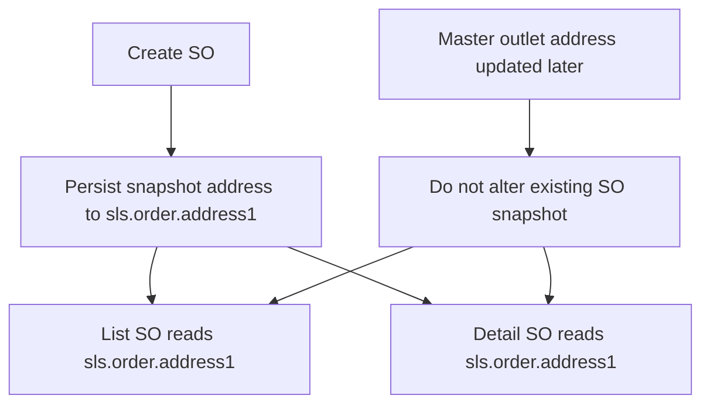

# SX-521 and SX-781 Fix Plan

## Objective

Fix the Sales Order outlet address bug so that:

1. Sales Order stores outlet address as a historical snapshot at order creation time.
2. Order list and order detail always return the snapshot address from sales order data.
3. The previous regression where `outlet_address1` becomes `null` in list and detail does not reappear.
4. Address snapshot is not accidentally overwritten by later master outlet changes.

## Scope

### In Scope

- `sales` service only
- Sales order create flow
- Sales order list flow
- Sales order detail v2 flow
- Order update behavior review for snapshot safety
- Regression coverage for SX-781 null-address behavior
- Documentation and verification steps for QA reproduction scenario

### Out of Scope

- Direct code changes in `master` service
- Direct fix for master outlet schema mismatch blocker
- UI or FE rendering changes
- Historical backfill for all legacy orders unless explicitly approved

## Confirmed Problem Statement

### SX-521

When QA creates a Sales Order and later changes outlet address in Master Outlet, Sales Order should continue showing the original address captured at creation time.

### SX-781

Order List and Order Detail previously showed empty outlet address because BE returned `outlet_address1 = null`.

## Current Implementation Findings

### Relevant Endpoints

- `POST /sales/v1/orders`
- `GET /sales/v1/orders`
- `GET /sales/v2/orders/:ro_no`

### Relevant Files

- `sales/controller/order_controller.go`
- `sales/service/order_service.go`
- `sales/repository/order_repository.go`
- `sales/entity/order.go`
- `sales/model/order.go`

### Existing Behavior Summary

1. The sales order model already has snapshot field `address1`.
2. Request DTO already has `outlet_address1`.
3. Detail v2 already reads `sls.order.address1`.
4. List query still uses fallback logic `COALESCE(sls.order.address1, ot.address1)`.
5. Create flow currently fills `order.address1` from master outlet lookup instead of directly treating payload `outlet_address1` as authoritative snapshot input.
6. Update flow appears to refresh snapshot address from master outlet when outlet changes are involved, which is risky for historical consistency.

## Root Cause Hypothesis

### Most Likely Cause 1

Snapshot persistence is not treated as a strict immutable order snapshot. The create flow depends on current master outlet lookup instead of explicitly persisting the request snapshot value.

### Most Likely Cause 2

List response still falls back to current master outlet address when order snapshot is null, which can hide data issues and can produce incorrect historical output after outlet master data changes.

## Target Design

### Snapshot Principle

`sls.order.address1` becomes the single source of truth for outlet address shown in Sales Order responses.

### Intended Read Rules

- Order list reads only from `sls.order.address1`
- Order detail reads only from `sls.order.address1`
- No runtime dependency on latest `mst.m_outlet.address1` for display value

### Intended Write Rules

- On create order, persist outlet address snapshot into `sls.order.address1`
- On edit order, do not silently replace historical snapshot because master outlet changed
- Snapshot may only change if there is an explicitly approved business rule for replacing selected outlet identity

## Implementation Plan

### Phase 1: Lock Snapshot Contract in Create Flow

1. Review create mapping in `sales/service/order_service.go`
2. Change create logic so `address1` is set from order snapshot input first
3. Keep master outlet lookup only as a controlled fallback if payload snapshot is empty and this fallback is still approved
4. Ensure stored snapshot is written once during initial order creation
5. Confirm transaction path still uses service-layer transaction pattern correctly

### Phase 2: Remove Historical Address Drift in Read Flows

1. Update list query in `sales/repository/order_repository.go`
2. Remove `COALESCE(sls.order.address1, ot.address1)` for outlet display field
3. Read `sls.order.address1` directly for `outlet_address1`
4. Re-verify detail v2 query stays aligned with same snapshot source
5. Confirm DTO mapping remains consistent in service and entity layers

### Phase 3: Protect Snapshot on Update Paths

1. Audit standard update flow in `sales/service/order_service.go`
2. Audit final/update-enhance related flows that may rebuild order header
3. Prevent snapshot address from being refreshed from current master outlet unless business rule explicitly requires it
4. If outlet identity changes are allowed in update, define exact rule:
   - same outlet, keep historical snapshot
   - different outlet selected intentionally, refresh snapshot from request-selected outlet data only if approved
5. Document decision clearly for implementation mode before coding if ambiguity remains

### Phase 4: Regression Safety for SX-781

1. Validate `outlet_address1` is populated in list response mapping
2. Validate `outlet_address1` is populated in detail v2 response mapping
3. Add regression test cases or reproducible verification cases for:
   - create order then list
   - create order then detail
   - create order then change master outlet address then list/detail again
4. Verify null-address regression cannot return unnoticed

### Phase 5: QA Scenario Verification

1. Reproduce the exact QA flow from staging notes
2. Create SO with outlet address A
3. Change outlet address in master to B
4. Verify order list still shows A
5. Verify order detail still shows A
6. Verify a newly created SO after master change shows B

## Detailed Task Breakdown

- Inspect all write paths touching `model.Order.Address1`
- Identify whether any repository update helper overwrites `address1`
- Update service create logic to use snapshot-first assignment
- Update list repository select to stop fallback to master outlet address
- Review detail query for consistency with list behavior
- Review update and enhance order flows for snapshot overwrite risk
- Add or update tests for create/list/detail snapshot behavior
- Add verification notes for QA replay scenario
- Document out-of-scope master-service schema blocker separately

## Files Expected to Change in Implementation Mode

### Likely Code Files

- `sales/service/order_service.go`
- `sales/repository/order_repository.go`
- `sales/entity/order.go` if response/request normalization is needed
- `sales/model/order.go` only if field tag cleanup is needed

### Possible Test Files

- existing order service tests if available
- existing repository tests if available
- new focused tests around order create/list/detail snapshot behavior if no suitable tests exist

## Decision Notes for Implementation Mode

### Recommended Rule

Use this rule unless you want to change it:

- For create order, `sls.order.address1` must be saved from the request snapshot value for the selected outlet
- For list and detail, `outlet_address1` must come only from `sls.order.address1`
- For update order, historical snapshot should remain unchanged unless outlet identity itself is intentionally replaced and this rule is explicitly approved

### Legacy Data Risk

If older rows have `sls.order.address1 = null`, removing fallback in list may expose old incomplete data.

Recommended handling options:

1. Strict fix only
   - no fallback
   - old bad rows remain visible as incomplete data
2. Transitional compatibility
   - keep fallback temporarily behind documented condition
   - schedule cleanup/backfill separately
3. Backfill plan
   - repair old rows before or alongside strict read change

This needs confirmation before implementation because it changes behavior for historical records.

## Non-Code Follow-up

### Master Service Blocker

Track separately that the master outlet update failure:

- `pq: column  of relation m_outlet does not exist`

is a dependency outside `sales` service and should be handled as a separate master/database alignment item.

### Suggested Follow-up Ticket

Create or link a follow-up task for:

- schema verification between `master` service payload mapping, migration state, and actual staging DB columns

## Verification Checklist

- `POST /sales/v1/orders` persists non-null snapshot address
- `GET /sales/v1/orders` returns snapshot address from order table
- `GET /sales/v2/orders/:ro_no` returns snapshot address from order table
- Changing master outlet address after SO creation does not change displayed order address
- New SO created after master address change uses the new address snapshot
- No null regression for `outlet_address1` in list/detail under normal create flow
- Multi-tenant filters remain intact
- No layer violation is introduced
- No repository business logic is added

## Suggested Execution Order for Code Mode

1. Confirm legacy-data strategy for null historical rows
2. Update create snapshot logic
3. Update list query to align snapshot read strategy
4. Audit and protect update flows
5. Add regression tests
6. Run QA verification scenario
7. Summarize behavior changes for release note

## Mermaid Overview

## Review Questions

1. Should historical rows with null `address1` be handled by strict no-fallback behavior or by temporary compatibility fallback?
2. Should update order be allowed to refresh snapshot address when outlet identity changes, or should snapshot stay immutable after initial create?
3. Should the master-service schema blocker be included only as a note, or should it be planned as a parallel follow-up item?
